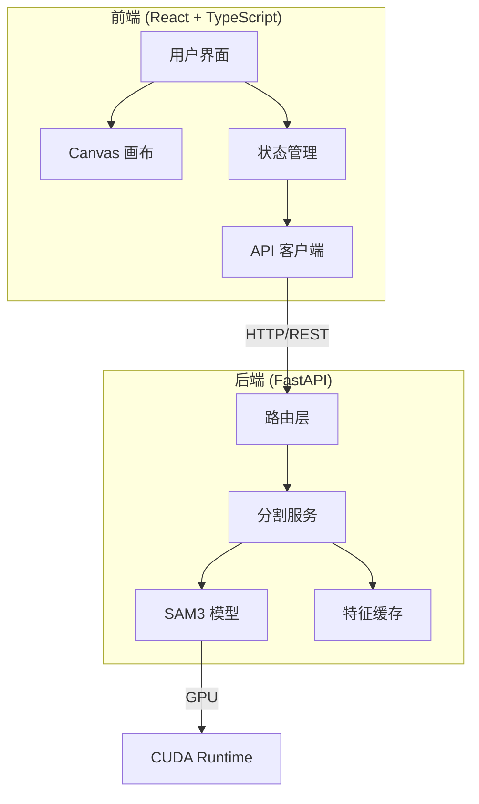
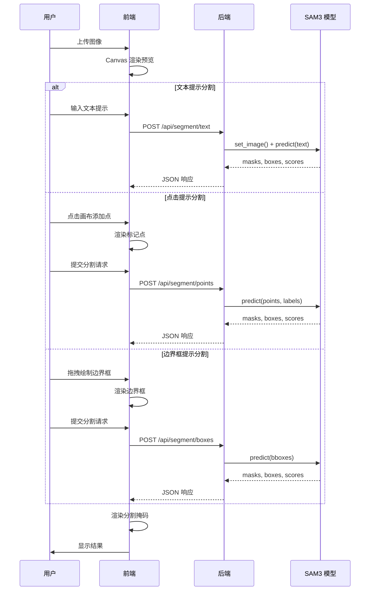
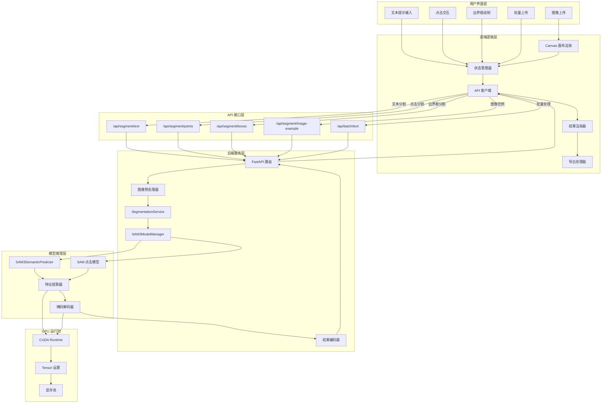
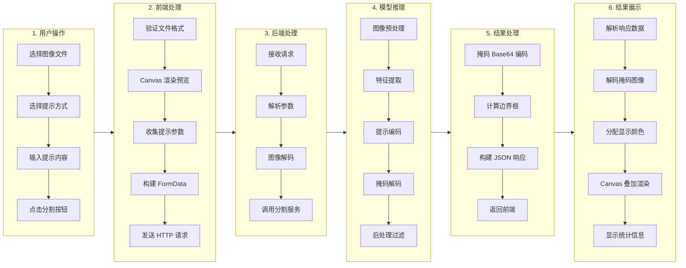
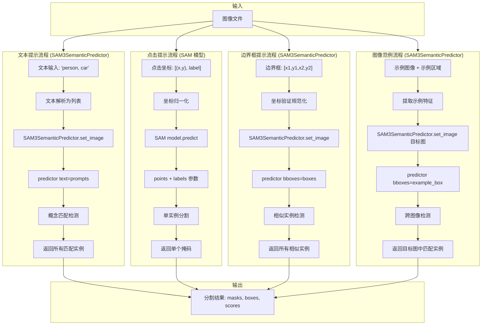
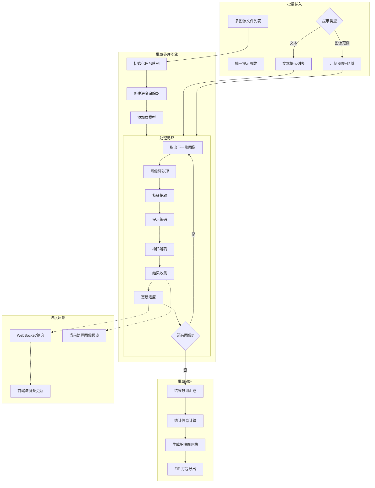
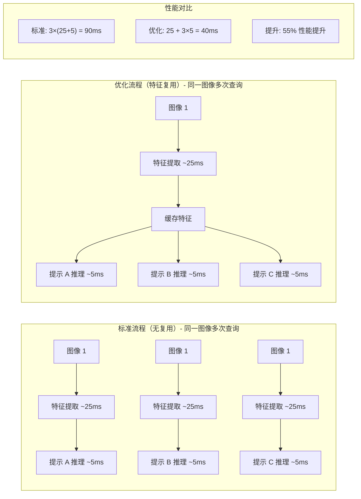

# 设计文档

## 概述

SAM3 演示项目采用前后端分离架构，后端基于 FastAPI 提供 RESTful API 服务，前端使用 React + TypeScript 构建交互界面。系统核心是 SAM3 模型推理服务，支持文本提示、点击提示和边界框提示三种分割方式。

**功能范围说明：本项目专注于图像分割功能，不支持视频分割与跟踪。**

### 推理接口说明

SAM3 提供两种不同的推理接口，需要根据提示类型选择：

| 接口 | 用途 | 特点 |
|-----|------|------|
| `SAM3SemanticPredictor` | 文本提示、边界框提示、图像范例 | 概念级分割，可检测所有匹配实例 |
| `SAM` 模型 | 点击提示 | 实例级分割（SAM2 兼容模式） |

**为什么需要两种接口？**
- 文本/边界框/图像范例需要概念理解能力，使用 `SAM3SemanticPredictor`
- 点击提示是精确的实例级操作，使用 `SAM` 模型更高效

### 推理接口说明

SAM3 提供两种不同的推理接口，需要根据提示类型选择：

| 接口 | 用途 | 特点 |
|-----|------|------|
| `SAM3SemanticPredictor` | 文本提示、边界框提示、图像范例 | 概念级分割，可检测所有匹配实例 |
| `SAM` 模型 | 点击提示 | 实例级分割（SAM2 兼容模式） |

**为什么需要两种接口？**
- 文本/边界框/图像范例需要概念理解能力，使用 `SAM3SemanticPredictor`
- 点击提示是精确的实例级操作，使用 `SAM` 模型更高效

### 设计目标

1. **高性能推理**: 利用 GPU 加速和特征复用优化推理性能
2. **直观交互**: 提供 Canvas 画布交互，支持实时预览和结果可视化
3. **模块化设计**: 前后端解耦，便于独立开发和部署
4. **可扩展性**: 预留批量处理和特征复用接口
5. **简洁专注**: 页面设计以功能实现为主，保持简洁

## 架构

### 系统架构图



### 推理工作流



### 项目调用流程图



### 完整请求处理流程图

以下流程图详细展示了从用户操作到结果返回的完整数据流转过程：



### 不同提示类型的推理流程对比

**关键区别**：SAM3 提供两种预测器，需要根据提示类型选择：
- `SAM3SemanticPredictor`：概念级分割（文本、边界框、图像范例）
- `SAM` 模型：实例级分割（点击提示，SAM2 兼容模式）



### 推理接口选择指南

| 提示类型 | 预测器 | API 调用方式 | 返回特点 |
|---------|--------|-------------|---------|
| 文本提示 | `SAM3SemanticPredictor` | `predictor(text=["person"])` | 所有匹配概念的实例 |
| 边界框提示 | `SAM3SemanticPredictor` | `predictor(bboxes=[[x1,y1,x2,y2]])` | 框内及相似实例 |
| 图像范例 | `SAM3SemanticPredictor` | `predictor(bboxes=[example_box])` | 目标图中相似实例 |
| 点击提示 | `SAM` | `model.predict(points=[], labels=[])` | 单个实例掩码 |

### 批量处理流程图



### 特征复用优化流程

**适用场景**：对**同一张图像**进行多次不同提示的查询（如交互式应用）

**不适用场景**：批量处理**不同图像**（每张图像特征不同，无法复用）



**批量处理不同图像时**：无法复用特征，每张图像必须单独提取特征，总耗时约 30ms × 图像数量。

## 组件和接口

### 后端组件

#### 1. SAM3ModelManager (模型管理器)

负责 SAM3 模型的加载、初始化和生命周期管理。

**重要说明**：SAM3 提供两种推理接口，需要根据提示类型选择：
- `SAM3SemanticPredictor`：用于文本提示、边界框提示、图像范例分割（概念级分割）
- `SAM` 模型：用于点击提示分割（SAM2 兼容模式，实例级分割）

```python
from ultralytics.models.sam import SAM3SemanticPredictor
from ultralytics import SAM

class SAM3ModelManager:
    """SAM3 模型管理器，单例模式"""
    
    def __init__(self, model_path: str = "sam3.pt", device: str = "cuda"):
        """
        初始化模型管理器
        
        Args:
            model_path: 模型文件路径
            device: 推理设备 ("cuda" 或 "cpu")
        """
        self.model_path = model_path
        self.device = device
        self._semantic_predictor = None  # 用于文本/边界框/图像范例
        self._point_model = None          # 用于点击提示
    
    def get_semantic_predictor(self) -> SAM3SemanticPredictor:
        """
        获取语义预测器实例
        
        用途：文本提示、边界框提示、图像范例分割
        特点：支持概念级分割，可检测所有匹配实例
        """
        if self._semantic_predictor is None:
            overrides = dict(
                conf=0.25,
                task="segment",
                mode="predict",
                model=self.model_path,
                half=True,  # 半精度推理优化
                verbose=False
            )
            self._semantic_predictor = SAM3SemanticPredictor(overrides=overrides)
        return self._semantic_predictor
    
    def get_point_model(self) -> SAM:
        """
        获取点提示模型实例（SAM2 兼容模式）
        
        用途：点击提示分割
        特点：基于点击位置进行单实例分割
        """
        if self._point_model is None:
            self._point_model = SAM(self.model_path)
        return self._point_model
    
    def is_ready(self) -> bool:
        """检查模型是否已加载就绪"""
        return self._semantic_predictor is not None or self._point_model is not None
```

#### 2. SegmentationService (分割服务)

核心业务逻辑层，处理各类分割请求。

**推理流程说明**：

| 提示类型 | 使用的预测器 | 返回结果 |
|---------|-------------|---------|
| 文本提示 | SAM3SemanticPredictor | 所有匹配概念的实例 |
| 边界框提示 | SAM3SemanticPredictor | 边界框内及相似实例 |
| 图像范例 | SAM3SemanticPredictor | 目标图中所有相似实例 |
| 点击提示 | SAM (SAM2 兼容) | 单个实例掩码 |

```python
import numpy as np
import time
from typing import List, Tuple

class SegmentationService:
    """分割服务，封装 SAM3 推理逻辑"""
    
    def __init__(self, model_manager: SAM3ModelManager):
        """
        初始化分割服务
        
        Args:
            model_manager: 模型管理器实例
        """
        self.model_manager = model_manager
    
    async def segment_with_text(
        self, 
        image: np.ndarray, 
        prompts: List[str],
        confidence: float = 0.25
    ) -> SegmentationResult:
        """
        文本提示分割 - 使用 SAM3SemanticPredictor
        
        推理流程：
        1. 获取 SAM3SemanticPredictor 实例
        2. 调用 set_image() 提取图像特征（耗时约 25ms）
        3. 调用 predictor(text=prompts) 执行文本提示推理（耗时约 5ms/概念）
        4. 返回所有匹配概念的掩码、边界框和置信度
        
        Args:
            image: 输入图像 (H, W, C) RGB 格式
            prompts: 文本提示列表，如 ["person", "car"]
            confidence: 置信度阈值
            
        Returns:
            SegmentationResult: 分割结果
        """
        start_time = time.time()
        predictor = self.model_manager.get_semantic_predictor()
        
        # 设置图像（提取特征）
        predictor.set_image(image)
        
        # 执行文本提示推理
        results = predictor(text=prompts)
        
        # 处理结果
        return self._process_semantic_results(results, image, start_time)
    
    async def segment_with_points(
        self,
        image: np.ndarray,
        points: List[Tuple[float, float]],
        labels: List[int]
    ) -> SegmentationResult:
        """
        点击提示分割 - 使用 SAM 模型（SAM2 兼容模式）
        
        推理流程：
        1. 获取 SAM 模型实例
        2. 调用 model.predict() 传入点坐标和标签
        3. 返回包含前景点、排除背景点的单个掩码
        
        注意：点击分割使用 SAM 模型而非 SAM3SemanticPredictor，
        因为点击是实例级操作，不需要概念理解能力。
        
        Args:
            image: 输入图像
            points: 点击坐标列表 [(x, y), ...]
            labels: 点标签列表 (1=前景, 0=背景)
            
        Returns:
            SegmentationResult: 分割结果
        """
        start_time = time.time()
        model = self.model_manager.get_point_model()
        
        # 执行点击提示推理
        results = model.predict(
            source=image,
            points=points,
            labels=labels
        )
        
        # 处理结果
        return self._process_point_results(results, image, start_time)
    
    async def segment_with_boxes(
        self,
        image: np.ndarray,
        boxes: List[List[float]]
    ) -> SegmentationResult:
        """
        边界框提示分割 - 使用 SAM3SemanticPredictor
        
        推理流程：
        1. 获取 SAM3SemanticPredictor 实例
        2. 调用 set_image() 提取图像特征
        3. 调用 predictor(bboxes=boxes) 执行边界框提示推理
        4. 返回边界框区域内及所有相似实例的掩码
        
        Args:
            image: 输入图像
            boxes: 边界框列表 [[x1, y1, x2, y2], ...]
            
        Returns:
            SegmentationResult: 分割结果
        """
        start_time = time.time()
        predictor = self.model_manager.get_semantic_predictor()
        
        predictor.set_image(image)
        results = predictor(bboxes=boxes)
        
        return self._process_semantic_results(results, image, start_time)
    
    async def segment_with_image_example(
        self,
        image: np.ndarray,
        example_image: np.ndarray,
        example_box: List[float]
    ) -> SegmentationResult:
        """
        图像范例分割 - 使用 SAM3SemanticPredictor
        
        推理流程：
        1. 从示例图像中提取示例区域的视觉特征
        2. 在目标图像中搜索所有视觉相似的实例
        3. 返回目标图像中所有匹配实例的掩码
        
        实现方式：
        - 使用示例图像的边界框区域作为视觉提示
        - SAM3 会自动提取该区域的视觉特征并在目标图中匹配
        
        Args:
            image: 目标图像
            example_image: 示例图像
            example_box: 示例区域边界框 [x1, y1, x2, y2]
            
        Returns:
            SegmentationResult: 分割结果
        """
        start_time = time.time()
        predictor = self.model_manager.get_semantic_predictor()
        
        # 步骤 1：从示例图像提取示例区域特征
        predictor.set_image(example_image)
        # 使用边界框提取示例特征（内部会缓存）
        
        # 步骤 2：在目标图像中搜索相似实例
        predictor.set_image(image)
        results = predictor(bboxes=[example_box])
        
        return self._process_semantic_results(results, image, start_time)
    
    async def batch_segment_with_text(
        self,
        images: List[np.ndarray],
        prompts: List[str],
        confidence: float = 0.25
    ) -> List[SegmentationResult]:
        """
        批量文本提示分割
        
        处理策略：
        - 逐张图像串行处理（每张图像特征不同，无法跨图像复用）
        - 对于每张图像：提取特征 → 执行推理 → 收集结果
        - 同一图像的多个提示词会在一次推理中处理
        
        性能说明：
        - 特征提取：~25ms/图像（无法优化，每张图像必须单独提取）
        - 推理：~5ms/图像（多个提示词一次性处理）
        - 总耗时：约 30ms × 图像数量
        
        Args:
            images: 输入图像列表
            prompts: 文本提示列表（所有图像使用相同提示）
            confidence: 置信度阈值
            
        Returns:
            List[SegmentationResult]: 分割结果列表
        """
        results = []
        predictor = self.model_manager.get_semantic_predictor()
        
        for image in images:
            start_time = time.time()
            # 每张图像必须单独提取特征（无法跨图像复用）
            predictor.set_image(image)
            # 多个提示词在一次推理中处理
            result = predictor(text=prompts)
            results.append(self._process_semantic_results(result, image, start_time))
        
        return results
    
    async def batch_segment_with_image_example(
        self,
        images: List[np.ndarray],
        example_image: np.ndarray,
        example_box: List[float]
    ) -> List[SegmentationResult]:
        """
        批量图像范例分割
        
        处理策略：
        - 逐张目标图像串行处理
        - 示例图像的特征会被 SAM3 内部缓存用于匹配
        
        注意：当前 SAM3 API 不支持直接的跨图像特征复用，
        每张目标图像仍需单独调用 set_image() 提取特征。
        
        Args:
            images: 目标图像列表
            example_image: 示例图像
            example_box: 示例区域边界框
            
        Returns:
            List[SegmentationResult]: 分割结果列表
        """
        results = []
        predictor = self.model_manager.get_semantic_predictor()
        
        for image in images:
            start_time = time.time()
            # 每张目标图像单独处理
            predictor.set_image(image)
            # 使用示例边界框作为视觉提示
            result = predictor(bboxes=[example_box])
            results.append(self._process_semantic_results(result, image, start_time))
        
        return results
    
    def _process_semantic_results(self, results, image, start_time) -> SegmentationResult:
        """处理 SAM3SemanticPredictor 的结果"""
        # 实现结果处理逻辑
        pass
    
    def _process_point_results(self, results, image, start_time) -> SegmentationResult:
        """处理 SAM 点击模型的结果"""
        # 实现结果处理逻辑
        pass
```

#### 3. API 路由接口

```python
# POST /api/segment/text
# 文本提示分割接口
# Request: multipart/form-data
#   - file: 图像文件
#   - prompts: 逗号分隔的文本提示
# Response: SegmentationResponse

# POST /api/segment/points  
# 点击提示分割接口
# Request: multipart/form-data
#   - file: 图像文件
#   - points: JSON 格式的点坐标数组
#   - labels: JSON 格式的标签数组
# Response: SegmentationResponse

# POST /api/segment/boxes
# 边界框提示分割接口
# Request: multipart/form-data
#   - file: 图像文件
#   - boxes: JSON 格式的边界框数组
# Response: SegmentationResponse

# POST /api/segment/image-example
# 图像范例分割接口
# Request: multipart/form-data
#   - file: 目标图像文件
#   - example_file: 示例图像文件
#   - example_box: JSON 格式的示例区域边界框
# Response: SegmentationResponse

# POST /api/batch/text
# 批量文本提示分割接口
# Request: multipart/form-data
#   - files: 多个图像文件
#   - prompts: 逗号分隔的文本提示
# Response: BatchSegmentationResponse

# POST /api/batch/image-example
# 批量图像范例分割接口
# Request: multipart/form-data
#   - files: 多个目标图像文件
#   - example_file: 示例图像文件
#   - example_box: JSON 格式的示例区域边界框
# Response: BatchSegmentationResponse

# GET /api/health
# 健康检查接口
# Response: {"status": "healthy", "model_loaded": true}
```

### 前端组件

#### 1. ImageCanvas (图像画布组件)

```typescript
interface ImageCanvasProps {
  image: HTMLImageElement | null;
  masks: MaskData[];
  points: PointPrompt[];
  boxes: BoxPrompt[];
  mode: InteractionMode;
  maskOpacity: number;
  showMasks: boolean;
  onPointAdd: (point: PointPrompt) => void;
  onBoxComplete: (box: BoxPrompt) => void;
  onMaskHover: (maskIndex: number | null) => void;
}

// ImageCanvas 组件职责:
// 1. 渲染原始图像
// 2. 渲染分割掩码叠加层
// 3. 渲染点击标记和边界框
// 4. 处理鼠标交互事件
// 5. 支持缩放和平移
```

#### 2. PromptPanel (提示面板组件)

```typescript
interface PromptPanelProps {
  mode: InteractionMode;
  textPrompt: string;
  points: PointPrompt[];
  boxes: BoxPrompt[];
  isLoading: boolean;
  onModeChange: (mode: InteractionMode) => void;
  onTextChange: (text: string) => void;
  onSubmit: () => void;
  onClearPoints: () => void;
  onClearBoxes: () => void;
}

// PromptPanel 组件职责:
// 1. 模式切换 (文本/点击/边界框)
// 2. 文本输入框
// 3. 点和边界框列表显示
// 4. 提交和清除按钮
```

#### 3. ResultPanel (结果面板组件)

```typescript
interface ResultPanelProps {
  result: SegmentationResult | null;
  maskOpacity: number;
  showMasks: boolean;
  onOpacityChange: (opacity: number) => void;
  onToggleMasks: () => void;
  onExportMask: () => void;
  onExportOverlay: () => void;
  onExportJSON: () => void;
}

// ResultPanel 组件职责:
// 1. 显示检测统计信息
// 2. 掩码透明度控制
// 3. 掩码显示/隐藏切换
// 4. 导出功能按钮
```

#### 4. useSegmentation (分割 Hook)

```typescript
interface UseSegmentationReturn {
  result: SegmentationResult | null;
  isLoading: boolean;
  error: string | null;
  segmentWithText: (image: File, prompts: string) => Promise<void>;
  segmentWithPoints: (image: File, points: PointPrompt[]) => Promise<void>;
  segmentWithBoxes: (image: File, boxes: BoxPrompt[]) => Promise<void>;
  segmentWithImageExample: (image: File, exampleImage: File, exampleBox: BoxPrompt) => Promise<void>;
  clearResult: () => void;
}

// useSegmentation Hook 职责:
// 1. 管理分割请求状态
// 2. 调用后端 API
// 3. 处理响应和错误
// 4. 缓存结果
```

#### 5. BatchPanel (批量处理面板组件)

```typescript
interface BatchPanelProps {
  mode: 'text' | 'image-example';
  files: File[];
  textPrompt: string;
  exampleImage: File | null;
  exampleBox: BoxPrompt | null;
  results: BatchResult[];
  progress: BatchProgress;
  isProcessing: boolean;
  onFilesChange: (files: File[]) => void;
  onTextChange: (text: string) => void;
  onExampleImageChange: (file: File | null) => void;
  onExampleBoxChange: (box: BoxPrompt | null) => void;
  onStartBatch: () => void;
  onCancelBatch: () => void;
  onExportAll: () => void;
}

// BatchPanel 组件职责:
// 1. 批量文件上传和管理
// 2. 统一提示输入（文本或图像范例）
// 3. 批量处理进度显示
// 4. 结果缩略图网格展示
// 5. 批量导出功能
```

#### 6. useBatchSegmentation (批量分割 Hook)

```typescript
interface BatchProgress {
  total: number;
  completed: number;
  currentIndex: number;
  status: 'idle' | 'processing' | 'completed' | 'error';
}

interface BatchResult {
  file: File;
  result: SegmentationResult | null;
  error: string | null;
}

interface UseBatchSegmentationReturn {
  results: BatchResult[];
  progress: BatchProgress;
  isProcessing: boolean;
  batchSegmentWithText: (files: File[], prompts: string) => Promise<void>;
  batchSegmentWithImageExample: (files: File[], exampleImage: File, exampleBox: BoxPrompt) => Promise<void>;
  cancelBatch: () => void;
  clearResults: () => void;
}

// useBatchSegmentation Hook 职责:
// 1. 管理批量处理状态和进度
// 2. 调用批量 API 或逐个处理
// 3. 支持取消操作
// 4. 汇总所有结果
```

## 数据模型

### 后端数据模型

```python
from pydantic import BaseModel
from typing import Optional

class PointPrompt(BaseModel):
    """点击提示"""
    x: float  # X 坐标
    y: float  # Y 坐标
    label: int  # 1=前景, 0=背景

class BoxPrompt(BaseModel):
    """边界框提示"""
    x1: float  # 左上角 X
    y1: float  # 左上角 Y
    x2: float  # 右下角 X
    y2: float  # 右下角 Y

class MaskData(BaseModel):
    """单个掩码数据"""
    mask_base64: str  # Base64 编码的 PNG 掩码
    bbox: list[float]  # 边界框 [x1, y1, x2, y2]
    score: float  # 置信度分数
    label: Optional[str] = None  # 对象标签（文本提示时）
    area: int  # 掩码面积（像素数）

class SegmentationResult(BaseModel):
    """分割结果"""
    masks: list[MaskData]  # 掩码列表
    count: int  # 检测对象数量
    processing_time_ms: float  # 处理耗时（毫秒）
    image_size: tuple[int, int]  # 原图尺寸 (width, height)

class SegmentationResponse(BaseModel):
    """API 响应"""
    success: bool
    data: Optional[SegmentationResult] = None
    error: Optional[str] = None

class BatchSegmentationResult(BaseModel):
    """批量分割结果"""
    results: list[SegmentationResult]  # 每张图像的分割结果
    total: int  # 总图像数
    success_count: int  # 成功数量
    failed_count: int  # 失败数量
    total_processing_time_ms: float  # 总处理耗时

class BatchSegmentationResponse(BaseModel):
    """批量 API 响应"""
    success: bool
    data: Optional[BatchSegmentationResult] = None
    error: Optional[str] = None
```

### 前端数据模型

```typescript
// 交互模式
type InteractionMode = 'text' | 'point' | 'box' | 'image-example';

// 点击提示
interface PointPrompt {
  x: number;
  y: number;
  label: 0 | 1;  // 0=背景, 1=前景
}

// 边界框提示
interface BoxPrompt {
  x1: number;
  y1: number;
  x2: number;
  y2: number;
}

// 掩码数据
interface MaskData {
  maskBase64: string;
  bbox: [number, number, number, number];
  score: number;
  label?: string;
  area: number;
  color: string;  // 前端分配的显示颜色
}

// 分割结果
interface SegmentationResult {
  masks: MaskData[];
  count: number;
  processingTimeMs: number;
  imageSize: [number, number];
}

// 应用状态
interface AppState {
  // 单图模式
  image: File | null;
  imageUrl: string | null;
  mode: InteractionMode;
  textPrompt: string;
  points: PointPrompt[];
  boxes: BoxPrompt[];
  result: SegmentationResult | null;
  isLoading: boolean;
  error: string | null;
  maskOpacity: number;
  showMasks: boolean;
  
  // 图像范例模式
  exampleImage: File | null;
  exampleImageUrl: string | null;
  exampleBox: BoxPrompt | null;
  
  // 批量模式
  batchMode: 'text' | 'image-example';
  batchFiles: File[];
  batchResults: BatchResult[];
  batchProgress: BatchProgress;
  isBatchProcessing: boolean;
}
```


## 正确性属性

*正确性属性是系统在所有有效执行中应保持为真的特征或行为。属性作为人类可读规范和机器可验证正确性保证之间的桥梁。*

### Property 1: 文件扩展名验证

*For any* 文件名字符串，验证函数应当接受扩展名为 jpg、jpeg、png、webp 的文件，并拒绝所有其他扩展名的文件。

**Validates: Requirements 1.1**

### Property 2: 图像缩放保持宽高比

*For any* 输入图像尺寸 (width, height) 和目标画布尺寸 (canvasWidth, canvasHeight)，缩放后的图像尺寸应满足：
- `scaledWidth / scaledHeight == width / height` (宽高比不变)
- `scaledWidth <= canvasWidth && scaledHeight <= canvasHeight` (不超出画布)

**Validates: Requirements 1.5**

### Property 3: 文本提示解析

*For any* 包含逗号分隔的文本字符串，解析函数应当：
- 正确分割为独立的提示词列表
- 去除每个提示词的首尾空白
- 过滤掉空字符串

**Validates: Requirements 2.2**

### Property 4: 结果显示包含标签和置信度

*For any* 分割结果中的掩码数据，渲染输出应当包含该掩码的标签文本和置信度分数。

**Validates: Requirements 2.4**

### Property 5: 点击坐标记录

*For any* Canvas 画布上的点击事件，记录的坐标应当与实际点击位置一致（考虑画布缩放和偏移）。

**Validates: Requirements 3.1**

### Property 6: 清除操作重置状态

*For any* 非空的点列表或边界框列表，执行清除操作后，对应的状态数组应当为空数组。

**Validates: Requirements 3.5, 4.4**

### Property 7: 边界框坐标记录

*For any* 拖拽绘制的边界框（起点和终点坐标），记录的 Box_Prompt 应当满足：
- `x1 <= x2 && y1 <= y2` (坐标已规范化)
- 坐标值在图像尺寸范围内

**Validates: Requirements 4.2**

### Property 8: 边界框坐标显示一致性

*For any* 已记录的边界框，界面显示的坐标值应当与内部状态中的坐标值完全一致。

**Validates: Requirements 4.5**

### Property 9: 掩码颜色唯一性

*For any* 包含 N 个掩码的分割结果（N > 1），分配的 N 个颜色应当两两不同。

**Validates: Requirements 5.1**

### Property 10: 掩码可见性切换

*For any* 掩码可见性状态 S，执行切换操作后状态应当变为 !S。

**Validates: Requirements 5.3**

### Property 11: 透明度值范围约束

*For any* 透明度滑块操作，更新后的透明度值应当满足 `0 <= opacity <= 1`。

**Validates: Requirements 5.4**

### Property 12: 统计信息完整性

*For any* 分割操作完成后的结果，显示的统计信息应当包含：
- 检测对象数量（与掩码数组长度一致）
- 处理耗时（非负数值）

**Validates: Requirements 5.5**

### Property 13: 错误请求返回 400

*For any* 格式错误的 API 请求（缺少必要字段、字段类型错误、无效的图像数据），服务应当返回 HTTP 400 状态码。

**Validates: Requirements 6.3**

### Property 14: JSON 导出 Round-Trip

*For any* 有效的分割结果，导出为 JSON 后再解析，应当得到与原始结果等价的数据结构（包含相同的掩码轮廓、边界框和元数据）。

**Validates: Requirements 9.3**

**Validates: Requirements 1.6**

### Property 16: 批量文件验证

*For any* 批量上传的文件列表，验证函数应当对每个文件独立验证扩展名，并返回所有无效文件的列表。

**Validates: Requirements 8.1**

### Property 17: 批量处理进度一致性

*For any* 批量处理任务，进度信息应当满足：

- `0 <= completed <= total`
- `currentIndex == completed` (当前处理索引与已完成数一致)
- 处理完成时 `completed == total`

**Validates: Requirements 8.4**

### Property 18: 批量结果数量一致性

*For any* 批量分割请求（文本提示或图像范例模式），返回的结果数组长度应当等于输入图像数组的长度。

**Validates: Requirements 8.2, 8.3**

## 错误处理

### 前端错误处理

| 错误场景 | 处理方式 |
|---------|---------|
| 文件格式不支持 | 显示错误提示，阻止上传 |
| 网络请求失败 | 显示错误提示，提供重试按钮 |
| API 返回错误 | 解析错误信息并显示 |
| Canvas 渲染失败 | 降级显示原图，记录错误日志 |

### 后端错误处理

| 错误场景 | HTTP 状态码 | 响应格式 |
|---------|------------|---------|
| 请求缺少必要字段 | 400 | `{"success": false, "error": "Missing required field: file"}` |
| 图像解码失败 | 400 | `{"success": false, "error": "Invalid image format"}` |
| 模型推理失败 | 500 | `{"success": false, "error": "Model inference failed: ..."}` |
| GPU 内存不足 | 503 | `{"success": false, "error": "GPU out of memory, please try smaller image"}` |

### 错误恢复策略

1. **模型重载**: 如果模型推理连续失败 3 次，尝试重新加载模型
2. **内存清理**: 每次请求后清理 GPU 缓存，防止内存泄漏
3. **请求超时**: 设置 30 秒超时，超时后返回 504 错误

## 测试策略

### 测试方法

本项目采用双重测试策略：

1. **单元测试**: 验证具体示例、边缘情况和错误条件
2. **属性测试**: 验证跨所有输入的通用属性

两种测试方法互补，共同提供全面的测试覆盖。

### 属性测试配置

- **测试框架**: 
  - 后端: pytest + hypothesis
  - 前端: vitest + fast-check
- **迭代次数**: 每个属性测试最少 100 次迭代
- **标签格式**: `Feature: sam3-demo, Property {number}: {property_text}`

### 后端测试计划

```python
# 属性测试示例

# Property 3: 文本提示解析
@given(st.text())
def test_text_prompt_parsing(text: str):
    """Feature: sam3-demo, Property 3: 文本提示解析"""
    result = parse_text_prompts(text)
    # 验证结果是列表
    assert isinstance(result, list)
    # 验证每个元素都是非空字符串
    for prompt in result:
        assert isinstance(prompt, str)
        assert prompt == prompt.strip()
        assert len(prompt) > 0

# Property 13: 错误请求返回 400
@given(st.dictionaries(st.text(), st.text()))
def test_invalid_request_returns_400(invalid_data: dict):
    """Feature: sam3-demo, Property 13: 错误请求返回 400"""
    response = client.post("/api/segment/text", data=invalid_data)
    assert response.status_code == 400
```

### 前端测试计划

```typescript
// 属性测试示例

// Property 1: 文件扩展名验证
test.prop(
  'validates file extensions correctly',
  [fc.string()],
  (filename) => {
    // Feature: sam3-demo, Property 1: 文件扩展名验证
    const validExtensions = ['jpg', 'jpeg', 'png', 'webp'];
    const ext = filename.split('.').pop()?.toLowerCase() || '';
    const isValid = validateFileExtension(filename);
    
    if (validExtensions.includes(ext)) {
      expect(isValid).toBe(true);
    } else {
      expect(isValid).toBe(false);
    }
  }
);

// Property 2: 图像缩放保持宽高比
test.prop(
  'maintains aspect ratio when scaling',
  [fc.integer({min: 1, max: 10000}), fc.integer({min: 1, max: 10000}),
   fc.integer({min: 1, max: 2000}), fc.integer({min: 1, max: 2000})],
  (width, height, canvasWidth, canvasHeight) => {
    // Feature: sam3-demo, Property 2: 图像缩放保持宽高比
    const { scaledWidth, scaledHeight } = calculateScaledSize(
      width, height, canvasWidth, canvasHeight
    );
    
    const originalRatio = width / height;
    const scaledRatio = scaledWidth / scaledHeight;
    
    expect(Math.abs(originalRatio - scaledRatio)).toBeLessThan(0.001);
    expect(scaledWidth).toBeLessThanOrEqual(canvasWidth);
    expect(scaledHeight).toBeLessThanOrEqual(canvasHeight);
  }
);
```

### 单元测试覆盖

| 模块 | 测试重点 |
|-----|---------|
| 文件验证 | 有效/无效扩展名、大小写、特殊字符 |
| 坐标转换 | 画布缩放、偏移计算、边界情况 |
| API 客户端 | 请求构造、响应解析、错误处理 |
| 状态管理 | 状态更新、清除操作、初始状态 |
| 导出功能 | PNG 生成、JSON 序列化、文件下载 |

### 集成测试

1. **端到端流程**: 上传图像 → 文本分割 → 结果显示 → 导出
2. **API 集成**: 前后端通信、CORS 配置、错误传递
3. **模型集成**: SAM3 模型加载、推理、结果处理
