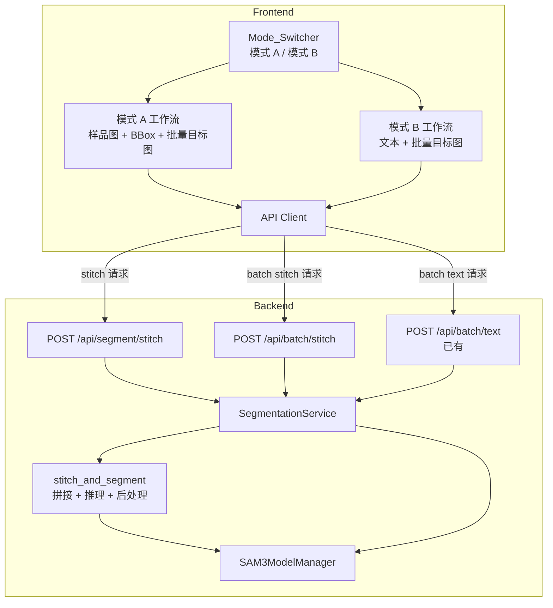
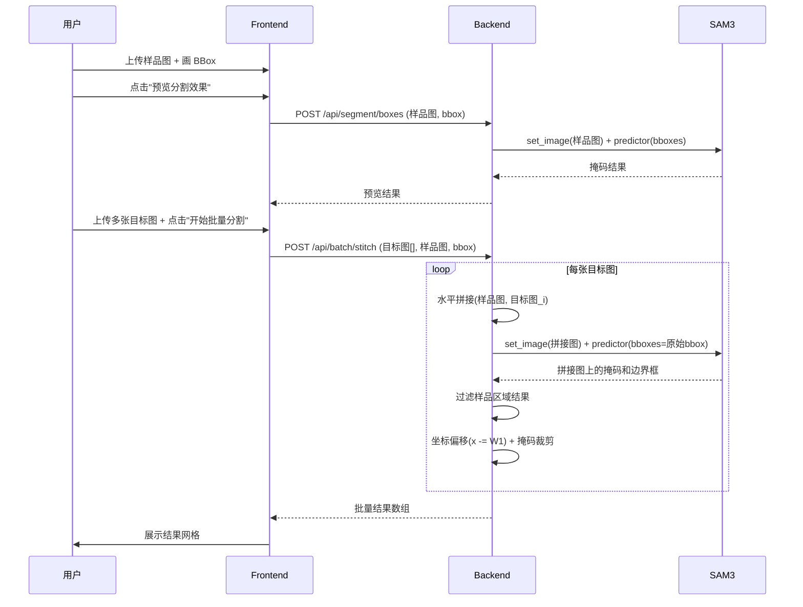

# 设计文档：SampleWorkflow 重构

## 概述

本设计将 SampleWorkflow 从失效的跨图像 `inference_features()` 方案重构为基于图像拼接的方案。核心思路：将样品图（左）和目标图（右）水平拼接为一张图，在拼接图上使用 SAM3 的 `bboxes` 提示（坐标指向左侧样品区域），SAM3 会在整张拼接图中找到所有视觉相似实例，然后后处理过滤掉样品区域的结果并将目标区域坐标偏移回原始坐标系。

同时新增纯文本批量分割模式，用户输入文本描述即可对多张图片进行批量分割。

所有旧的跨图像代码（`segment_with_image_example`、`batch_segment_with_image_example`、`_process_inference_features_results` 及对应端点）将被彻底移除。

## 架构



### 拼接推理流程（模式 A）



## 组件与接口

### 后端组件

#### 1. 图像拼接工具函数

```python
def stitch_images(
    sample: np.ndarray,   # (H1, W1, 3)
    target: np.ndarray,   # (H2, W2, 3)
) -> tuple[np.ndarray, int, int]:
    """水平拼接样品图（左）和目标图（右）。

    高度不同时，较矮的图像底部填充黑色像素。

    Returns:
        stitched: 拼接后图像 (max(H1,H2), W1+W2, 3)
        sample_width: W1（用于后续坐标偏移）
        target_width: W2
    """
```

#### 2. 后处理工具函数

```python
def filter_and_offset_results(
    masks: np.ndarray,          # (N, H, W) 布尔掩码
    boxes: np.ndarray,          # (N, 4 or 6) 边界框
    scores: np.ndarray,         # (N,) 置信度
    sample_width: int,          # W1
    target_width: int,          # W2
    target_height: int,         # H2
) -> tuple[np.ndarray, np.ndarray, np.ndarray]:
    """过滤样品区域结果，偏移目标区域坐标，裁剪掩码。

    过滤规则：bbox 的 x2 <= sample_width 的结果被丢弃。
    偏移规则：保留结果的 bbox x 坐标减去 sample_width。
    裁剪规则：掩码从 x=sample_width 开始裁剪，宽度为 target_width。

    Returns:
        filtered_masks: (M, target_height, target_width)
        filtered_boxes: (M, 4) 偏移后的坐标
        filtered_scores: (M,)
    """
```

#### 3. SegmentationService 新方法

```python
async def segment_with_stitch(
    self,
    target_image: np.ndarray,
    sample_image: np.ndarray,
    sample_box: list[float],
) -> SegmentationResult:
    """单张拼接分割。"""

async def batch_segment_with_stitch(
    self,
    target_images: list[np.ndarray],
    sample_image: np.ndarray,
    sample_box: list[float],
) -> list[SegmentationResult]:
    """批量拼接分割，逐张处理。"""
```

#### 4. 新 API 端点

| 端点 | 方法 | 参数 | 描述 |
|------|------|------|------|
| `/api/segment/stitch` | POST | `file` (目标图), `sample_file` (样品图), `sample_box` (JSON [x1,y1,x2,y2]) | 单张拼接分割 |
| `/api/batch/stitch` | POST | `files` (目标图[]), `sample_file` (样品图), `sample_box` (JSON [x1,y1,x2,y2]) | 批量拼接分割 |

#### 5. 移除的代码

- `SegmentationService.segment_with_image_example()`
- `SegmentationService.batch_segment_with_image_example()`
- `SegmentationService._process_inference_features_results()`
- `POST /api/segment/image-example` 端点
- `POST /api/batch/image-example` 端点

### 前端组件

#### 1. SampleWorkflow 组件重构

SampleWorkflow 组件将支持两种模式，通过 `Mode_Switcher` 切换：

- 模式 A（拼接+BBox）：保留现有的样品图上传、BBox 绘制、预览功能，批量分割改为调用 `/api/batch/stitch`
- 模式 B（纯文本）：新增文本输入框，批量分割调用 `/api/batch/text`

状态管理：

```typescript
type WorkflowMode = 'stitch' | 'text';

// 模式 A 状态（大部分复用现有逻辑）
sampleFile, sampleImg, sampleBox  // 已有
batchFiles                         // 已有

// 模式 B 状态
textPrompt: string                 // 新增

// 共享状态
mode: WorkflowMode                 // 新增
batchResults, progress             // 已有
```

#### 2. API Client 更新

```typescript
// 新增
export async function segmentWithStitch(
  targetImage: File,
  sampleImage: File,
  sampleBox: BoxPrompt,
): Promise<SegmentationResult>

export async function batchSegmentWithStitch(
  files: File[],
  sampleImage: File,
  sampleBox: BoxPrompt,
): Promise<BatchSegmentationResult>

// 移除
// segmentWithImageExample
// batchSegmentWithImageExample
```

#### 3. useBatchSegmentation Hook 更新

```typescript
// 替换 batchSegmentWithImageExample 为 batchSegmentWithStitch
batchSegmentWithStitch: (
  files: File[],
  sampleImage: File,
  sampleBox: BoxPrompt,
) => Promise<void>
```

## 数据模型

### 后端数据模型

现有的 Pydantic 模型（`SegmentationResult`、`BatchSegmentationResult`、`SegmentationResponse`、`BatchSegmentationResponse`）无需修改，拼接分割的返回格式与现有格式完全一致。

请求参数通过 FastAPI 的 `File` 和 `Form` 接收，无需新增 Pydantic 请求模型。

### 前端数据模型

```typescript
// 新增模式类型
type WorkflowMode = 'stitch' | 'text';

// InteractionMode 类型更新：移除 'image-example'
export type InteractionMode = 'text' | 'point' | 'box';
```

现有的 `SegmentationResult`、`BatchSegmentationResult`、`BoxPrompt` 等类型无需修改。

### 拼接图像坐标系

```
┌──────────────┬──────────────┐
│  样品图 (W1)  │  目标图 (W2)  │
│              │              │
│  BBox 坐标    │  SAM3 检测    │
│  [x1,y1,     │  结果坐标     │
│   x2,y2]     │  需要 -W1     │
│              │              │
│  H = max(H1, H2)           │
└──────────────┴──────────────┘
  x=0          x=W1          x=W1+W2
```

后处理逻辑：
1. 过滤：丢弃 `bbox.x2 <= W1` 的结果（完全在样品区域内）
2. 偏移：保留结果的 `bbox.x -= W1`
3. 裁剪：掩码数组从 `[:, :, W1:W1+W2]` 裁剪


## 正确性属性

*正确性属性是系统在所有有效执行中都应保持为真的特征或行为——本质上是关于系统应该做什么的形式化陈述。属性是人类可读规范与机器可验证正确性保证之间的桥梁。*

### Property 1: 拼接图像尺寸正确性

*对于任意*两张 RGB 图像（样品图 W1×H1 和目标图 W2×H2），`stitch_images` 函数返回的拼接图像宽度应等于 W1+W2，高度应等于 max(H1, H2)，且左侧 W1 列的像素应与样品图一致，右侧 W2 列的像素应与目标图一致。

**Validates: Requirements 2.1**

### Property 2: 过滤 + 偏移 + 裁剪正确性

*对于任意*一组拼接图上的掩码和边界框结果，以及任意 sample_width (W1) 和 target_width (W2)，`filter_and_offset_results` 函数应满足：
- (a) 返回结果中不包含任何 x2 <= W1 的边界框
- (b) 返回结果中所有边界框的 x 坐标相比原始值减少了 W1
- (c) 返回的掩码宽度等于 W2

**Validates: Requirements 2.3, 2.4, 2.5**

### Property 3: 批量拼接分割结果数量一致性

*对于任意* N 张目标图像的批量拼接分割请求，`batch_segment_with_stitch` 返回的结果数组长度应等于 N。

**Validates: Requirements 3.3**

### Property 4: 批量文本分割结果数量一致性

*对于任意* N 张目标图像的批量文本分割请求，`batch_segment_with_text` 返回的结果数组长度应等于 N。

**Validates: Requirements 4.2**

### Property 5: 模式切换清除状态

*对于任意*前端状态（包含已上传文件、分割结果、进度信息），当用户切换工作流模式时，所有模式相关状态（已上传文件、分割结果、进度）应被重置为初始值。

**Validates: Requirements 5.4**

## 错误处理

### 后端错误处理

| 场景 | HTTP 状态码 | 错误描述 |
|------|------------|---------|
| 缺少目标图文件 | 400 | "至少需要一张目标图" |
| 缺少样品图文件 | 400 | "样品图文件是必需的" |
| 缺少或无效的 sample_box JSON | 400 | "无效的 sample_box 格式" |
| 拼接图尺寸超出限制（宽或高 > 8192px） | 400 | "拼接后图像尺寸超出限制" |
| 文本描述为空 | 400 | "文本描述不能为空" |
| 图像文件格式无效 | 400 | "无效的图像文件" |
| GPU 内存不足 | 503 | "GPU 内存不足，请稍后重试" |
| SAM3 推理失败 | 500 | "分割处理失败: {详细信息}" |

### 前端错误处理

- 模式 A：样品图或 BBox 未设置时，"开始批量分割"按钮禁用
- 模式 B：文本描述为空时，点击"开始批量分割"显示提示消息
- 网络错误：显示友好的错误提示
- 批量处理中单张图片失败：该图片标记为失败，继续处理其余图片

## 测试策略

### 属性测试（Property-Based Testing）

使用 `hypothesis` 库（Python）进行属性测试，每个属性至少运行 100 次迭代。

| 属性 | 测试目标 | 生成器 |
|------|---------|--------|
| Property 1 | `stitch_images` | 随机尺寸的 RGB numpy 数组 |
| Property 2 | `filter_and_offset_results` | 随机边界框列表 + 随机掩码数组 + 随机 W1/W2 |
| Property 3 | `batch_segment_with_stitch` | 随机数量的图像（使用 mock SAM3） |
| Property 4 | `batch_segment_with_text` | 随机数量的图像（使用 mock SAM3） |
| Property 5 | SampleWorkflow 组件状态 | React Testing Library + 随机状态 |

每个属性测试必须用注释标注对应的设计属性：
```python
# Feature: sample-workflow-refactor, Property 1: 拼接图像尺寸正确性
```

### 单元测试

- `stitch_images`：测试相同高度、不同高度、极小图像的拼接
- `filter_and_offset_results`：测试全部在样品区域、全部在目标区域、混合分布的情况
- API 端点：测试参数验证、错误响应格式
- 前端组件：测试模式切换 UI、按钮禁用状态、错误提示显示

### 测试框架

- 后端：`pytest` + `hypothesis` + `httpx`（AsyncClient）
- 前端：`vitest` + `@testing-library/react` + `fast-check`（属性测试）
