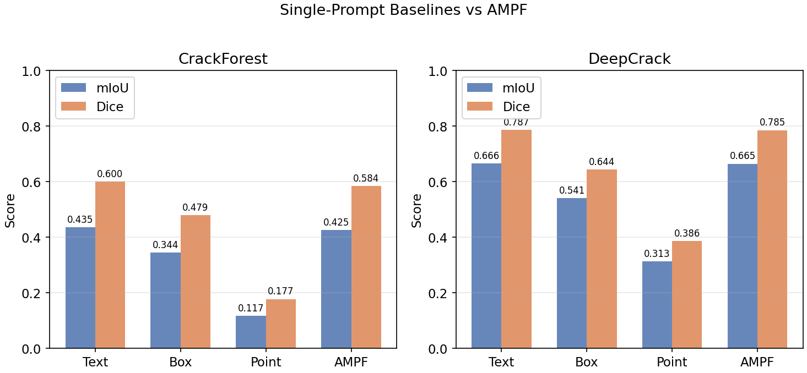
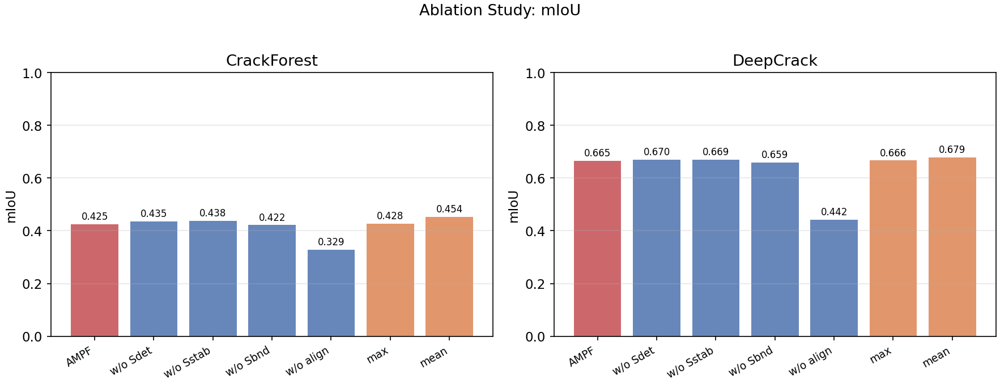
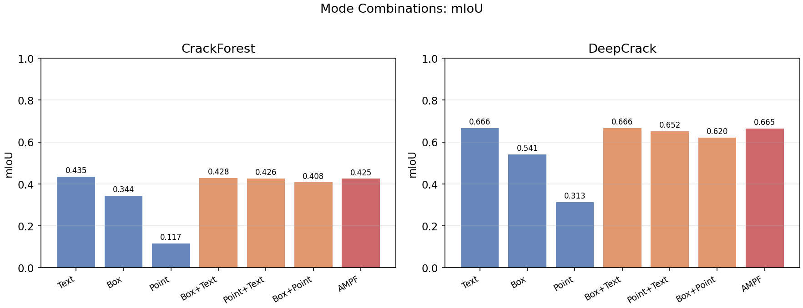
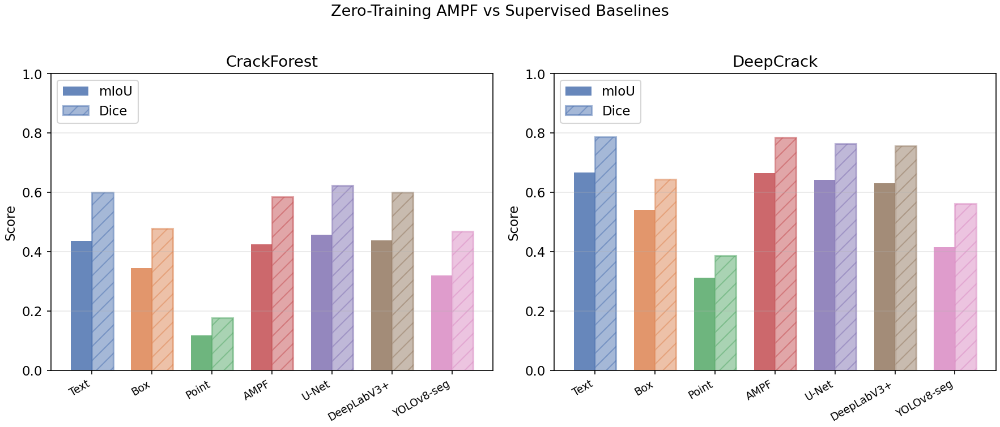

# Training-Free Crack Segmentation for Smart Infrastructure Inspection: A Systematic Evaluation of SAM3 Prompt Modes and Fusion Strategies

## Abstract

Timely crack segmentation is a core task in smart infrastructure inspection because surface cracks in roads, bridges, tunnels, and concrete structures provide early visual evidence of material deterioration. Conventional deep learning methods can achieve strong segmentation performance, but they usually require task-specific pixel-level annotations and retraining when the scene, material, or acquisition condition changes. Promptable vision foundation models provide an alternative route: they can segment user-specified concepts or spatial regions at inference time. This paper presents a systematic evaluation of Segment Anything Model 3 (SAM3) for training-free crack segmentation under three prompt modes: text, bounding box, and point prompts. We further evaluate an Adaptive Multi-Prompt Fusion (AMPF) pipeline consisting of independent prompting, instance-level alignment, and confidence-aware mask fusion.

Experiments were conducted on CrackForest and DeepCrack with an explicit protocol separating automatic text prompting from ground-truth-assisted spatial prompting and alignment. The results show that text prompting is the strongest single SAM3 mode for crack segmentation, reaching a mean foreground IoU/Dice of 0.4355/0.6000 on CrackForest and 0.6658/0.7866 on DeepCrack without model training. Box and point prompts, although generated from ground-truth masks as GT-derived diagnostic prompts, underperform text prompting. Under a centroid-derived point protocol, point prompting is especially weak for elongated crack structures. Full confidence-weighted AMPF improves precision relative to text prompting on DeepCrack, but it does not improve foreground IoU. Under the GT-assisted alignment protocol, a simple mean-fusion variant achieves the highest diagnostic foreground IoU on both datasets, reaching 0.4535 on CrackForest and 0.6791 on DeepCrack. Ablation studies show that instance-level alignment is the critical component: removing it reduces foreground IoU from 0.6645 to 0.4418 on DeepCrack. These findings suggest that SAM3 text prompting is a strong deployable default for low-label infrastructure inspection, while multi-prompt fusion should be used cautiously and evaluated under explicit prompt protocols.

**Keywords:** smart infrastructure inspection; crack segmentation; SAM3; vision foundation model; promptable segmentation; training-free segmentation; multi-prompt fusion; urban maintenance

## 1. Introduction

Urban infrastructure systems require continuous monitoring to ensure safety, serviceability, and cost-effective maintenance. Surface cracks in pavement, bridges, tunnels, and concrete components are among the most common visual indicators used by maintenance agencies. Manual crack inspection remains expensive, subjective, and difficult to scale across large urban networks. Computer vision offers a practical pathway toward automated infrastructure condition assessment, especially when integrated with mobile mapping vehicles, unmanned aerial systems, fixed cameras, or digital twin platforms.

Deep convolutional networks have been widely used for crack detection and segmentation. Architectures such as U-Net, DeepLabV3+, and YOLO-style segmentation models can learn discriminative features from labeled datasets. However, their deployment in real infrastructure inspection is constrained by three factors. First, pixel-level crack annotation is labor-intensive. Second, models trained on one dataset often experience domain shift when applied to different pavement textures, illumination conditions, camera viewpoints, or structural materials. Third, retraining and validating a supervised model for every new city, asset type, or acquisition platform increases maintenance cost.

Promptable foundation models change this design space. Instead of training a task-specific segmentation network from scratch, a foundation model can be queried by text prompts, bounding boxes, point clicks, or other prompt types. SAM3 extends promptable segmentation toward concept-level segmentation and supports text, box, and point-based interactions in the implementation studied here. This creates an attractive possibility for smart infrastructure inspection: a model may segment cracks from a simple text prompt such as "crack", or from sparse spatial prompts, without domain-specific fine-tuning.

Despite this promise, the behavior of different prompt modes is not obvious for crack segmentation. Cracks are thin, elongated, discontinuous, and often low contrast. A prompt mode designed for compact objects may fail on such structures. Moreover, SAM3 prompt modes are structurally heterogeneous: text and box prompts can return multiple candidate masks, while point prompts are local and typically tied to individual instances. This heterogeneity makes multi-prompt fusion nontrivial. It is therefore insufficient to ask only whether SAM3 can segment cracks; one must also ask which prompt modes are reliable, how they fail, and whether their outputs can be fused in a principled way.

This paper addresses these questions through a systematic empirical study based on the current `sam3-demo` codebase and the complete experimental results stored under `experiments/`. The study focuses on training-free crack segmentation for smart infrastructure inspection and evaluates three categories of methods:

1. single SAM3 prompt modes: text, box, and point;
2. AMPF and its ablations: instance alignment, confidence components, and fusion rules;
3. supervised baselines: U-Net, DeepLabV3+, and YOLOv8-seg.

The contribution of the paper is not a claim that complex prompt fusion always outperforms simpler prompting. The results show the opposite in several cases. The main contributions are:

1. A controlled evaluation of SAM3 text, box, and point prompt modes for crack segmentation on CrackForest and DeepCrack.
2. An explicit protocol distinction between deployable automatic text prompting, ground-truth-assisted oracle spatial prompting, and ground-truth-assisted alignment.
3. An instance-level alignment procedure for comparing and fusing heterogeneous prompt outputs, with ablation evidence showing that alignment is essential.
4. An empirical analysis of fusion strategies showing that simple mean fusion outperforms the implemented confidence-weighted AMPF on foreground IoU, while confidence-weighted AMPF shifts the precision-recall trade-off.
5. A comparison against supervised baselines that contextualizes the value of SAM3 training-free segmentation for low-label smart infrastructure applications.

## 2. Related Work

### 2.1 Crack Segmentation for Infrastructure Inspection

Crack segmentation has been studied as a pixel-level vision problem for pavement, concrete, and structural health monitoring. Early approaches relied on hand-crafted image processing, including edge detection, thresholding, morphological operations, and texture descriptors. These methods are sensitive to illumination, shadows, stains, and surface texture.

Deep learning methods improved robustness by learning hierarchical representations. U-Net and its variants are widely used for dense crack segmentation because skip connections preserve spatial detail. DeepLabV3+ introduces atrous spatial pyramid pooling and encoder-decoder refinement for multi-scale semantic segmentation. YOLOv8-seg and related instance segmentation models provide efficient object-level masks, although thin crack structures can be challenging for detection-oriented models. Dataset-specific architectures such as DeepCrack further exploit hierarchical features for crack segmentation. However, supervised methods depend on labeled examples and may require retraining under domain shift.

### 2.2 Promptable Segmentation and SAM3

The Segment Anything family introduced promptable segmentation as a general visual interface. Instead of fixing a closed task label space, users provide spatial or semantic prompts and the model returns segmentation masks. The SAM3 implementation evaluated in this study supports text-based concept segmentation, box-based prompting, and point-based prompting. In infrastructure inspection, this is appealing because visual targets such as cracks, spalling, corrosion, or road markings can in principle be queried by natural language or sparse interactive prompts.

However, promptable segmentation models are not guaranteed to perform equally well across all prompt modes or all object geometries. Cracks are not compact objects; they are narrow, branching, and often fragmented. This makes them a useful stress test for promptable foundation models.

### 2.3 Multi-Prompt Fusion

Multi-prompt fusion aims to combine complementary information from different prompts. Text prompts provide semantic intent and global search. Box prompts provide spatial or exemplar information. Point prompts provide local instance information. In practice, their outputs can differ in cardinality, spatial extent, and confidence calibration. Naively unioning masks from different prompt modes can introduce false positives, while averaging unaligned masks can suppress true positives.

The AMPF implementation evaluated here addresses this by performing instance-level alignment before fusion. This study evaluates whether such a strategy helps in crack segmentation and which components are responsible for performance changes.

## 3. Materials and Methods

### 3.1 Task Definition

Given an RGB image \(I \in \mathbb{R}^{H \times W \times 3}\), the objective is to predict a binary crack mask \(M \in \{0,1\}^{H \times W}\). Predictions are evaluated against pixel-level ground truth using per-image foreground crack Intersection over Union (IoU) averaged over the test set, Dice coefficient, precision, recall, and F1 score.

The SAM3 prompt modes studied in this paper produce different types of outputs:

- **Text prompt:** a concept prompt, implemented as `"crack"`, returns one or more candidate crack masks over the full image.
- **Box prompt:** a bounding box prompt returns one or more masks associated with the specified region or visual exemplar.
- **Point prompt:** one centroid-derived positive point per GT connected crack component returns a local mask for the prompted component. The centroid is not guaranteed to lie on crack pixels for concave, branching, or sparse elongated components.

The central methodological issue is that these outputs are not directly comparable. Text and box modes can return multiple masks per image. Point mode is instance-local and is invoked once per generated point. A fusion procedure therefore needs an alignment step before pixel-level mask combination.

### 3.2 Prompt Protocols

The experiment CSV files include a `protocol` field. This field is essential for interpreting the results.

| Protocol | Methods | Uses GT to Generate Prompt | Uses GT for Alignment | Interpretation |
|---|---|---:|---:|---|
| `automatic_text_prompt` | Text | No | No | Deployable automatic text-prompt baseline |
| `oracle_gt_prompt` | Box, Point | Yes | No | GT-derived single-box and centroid-point diagnostic protocol |
| `oracle_gt_prompt_gt_alignment` | AMPF, ablations, mode combinations | Yes | Yes | Ground-truth-assisted fusion and alignment analysis |
| `supervised_train_val_test` | U-Net, DeepLabV3+, YOLOv8-seg | Yes, during training | No | Standard supervised baseline |

This protocol distinction prevents an important misinterpretation. Text prompting is a deployable training-free method in this study. Box, point, and AMPF variants are not fully automatic deployment methods because their prompts or alignment use ground-truth masks. They are best interpreted as diagnostic protocols for understanding SAM3 behavior and multi-prompt fusion, rather than as oracle upper bounds or fully automatic deployment methods.

### 3.3 Prompt Generation

Prompt generation is implemented in `experiments/prompt_generator.py`.

For text mode, the prompt is fixed:

\[
p_\text{text} = \text{"crack"}.
\]

For box mode, the minimum axis-aligned bounding rectangle of all foreground pixels in the ground-truth mask is used:

\[
p_\text{box} = [x_{\min}, y_{\min}, x_{\max}, y_{\max}].
\]

For point mode, the ground-truth mask is decomposed into connected components. The centroid of each component is used as one positive point prompt. Because this centroid is not guaranteed to lie on crack pixels for concave, branching, or sparse elongated components, this point protocol is treated as a centroid-point diagnostic baseline rather than an oracle foreground-point upper bound. All point labels are positive.

### 3.4 Adaptive Multi-Prompt Fusion

AMPF is implemented in `sam3-demo/backend/app/services/ampf_engine.py` as a three-stage inference-time pipeline.

#### 3.4.1 Stage 1: Independent Prompting

Text, box, and point prompts are executed independently. Text mode uses a SAM3 confidence threshold of 0.25. Point mode selects the highest-scoring mask when multiple masks are returned for a point prompt. Candidate masks are stored with their detection scores and prompt mode.

#### 3.4.2 Stage 2: Instance-Level Alignment

The ground-truth mask is decomposed into connected components. For each ground-truth instance, text and box candidates are matched by selecting the candidate with the highest IoU above a threshold of 0.1. Point candidates are matched by prompt order and checked by IoU. This produces an aligned set of zero to three candidates for each crack instance.

This stage is diagnostic and GT-assisted. Its purpose is to isolate the problem of heterogeneous prompt-output fusion. It should not be described as a fully automatic deployment algorithm unless replaced by an automatic instance proposal and alignment mechanism.

#### 3.4.3 Stage 3: Confidence-Aware Fusion

For each aligned candidate, AMPF computes a composite confidence:

\[
C = \alpha S_{\text{det}} + \beta S_{\text{stab}} + \gamma S_{\text{bound}},
\]

where \(\alpha = 0.4\), \(\beta = 0.35\), and \(\gamma = 0.25\).

\(S_{\text{det}}\) is the SAM3 detection or segmentation score. \(S_{\text{stab}}\) measures consistency under prompt perturbation: text prompts are varied using synonyms, box prompts are shifted by a small percentage, and point prompts are perturbed by a few pixels. \(S_{\text{bound}}\) measures image-gradient strength near the predicted mask boundary when the source image is available, falling back to a mask-contour sharpness proxy otherwise.

Candidates below confidence 0.5 are filtered. If all candidates are below threshold, the highest-confidence candidate is retained. Remaining masks are fused by confidence-weighted pixel averaging, binarized at threshold 0.5, and post-processed by morphological closing followed by opening using a 3 by 3 elliptical kernel. Fused instance masks are combined by logical OR.

### 3.5 Evaluation Metrics

The evaluation code in `experiments/evaluation.py` computes:

\[
\text{IoU} = \frac{|P \cap G|}{|P \cup G|},
\]

\[
\text{Dice} = \frac{2|P \cap G|}{|P| + |G|},
\]

\[
\text{Precision} = \frac{TP}{TP+FP}, \quad
\text{Recall} = \frac{TP}{TP+FN},
\]

\[
F1 = \frac{2 \cdot \text{Precision} \cdot \text{Recall}}{\text{Precision} + \text{Recall}}.
\]

Masks are binarized before metric computation. We report per-image foreground crack IoU averaged over the test set, rather than class-averaged mIoU including background. All metrics are computed per image and then averaged over the test set.

## 4. Experimental Setup

### 4.1 Datasets

Two public crack datasets are used.

| Dataset | Images | Resolution | Split Used in Code | Test Images | Scene Characteristics |
|---|---:|---|---|---:|---|
| CrackForest | 118 labeled pairs | 480 by 320 | 60/20/20 random split, seed 42 | 24 | Urban pavement cracks |
| DeepCrack | 537 labeled pairs | Multi-scale | Official test split; train split divided 80/20 for train/val | 237 | Pavement, bridge, and concrete cracks |

CrackForest ground truth is loaded from MATLAB files where crack pixels correspond to the segmentation label used in the loader. DeepCrack labels are loaded from PNG masks and binarized at threshold 127. The dataset loader has tests verifying that train, validation, and test splits are disjoint.

### 4.2 Implementation Environment

The experiments recorded in `EXPERIMENTS.md` used an NVIDIA GeForce RTX 3090 GPU with 24 GB VRAM, CUDA-enabled PyTorch, Ultralytics SAM3, and `sam3.pt` in half precision. The complete result table contains 4176 rows in `experiments/results/all_results.csv`.

The supervised baselines include U-Net, DeepLabV3+, and YOLOv8-seg under the `supervised_train_val_test` protocol. U-Net and DeepLabV3+ are implemented with `segmentation_models_pytorch` using ResNet-34 encoders with ImageNet initialization, trained for 50 epochs with Adam optimizer and a combined BCE+Dice loss. They are intended as reference supervised baselines rather than exhaustively tuned state-of-the-art crack segmentation systems. YOLOv8-seg uses the Ultralytics training interface after converting masks to polygon annotations, trained for 100 epochs with default YOLO settings. Results reported below are taken from `experiments/results/summary_stats.csv` and `experiments/results/paper_tables.tex`.

### 4.3 Statistical Analysis

Where paired comparisons are discussed, per-image IoU values are matched by `image_id`. Wilcoxon signed-rank tests are used for paired non-parametric comparison. These tests are used as descriptive statistical support rather than as the sole basis for claims, because protocols differ in deployability and CrackForest has only 24 test images.

## 5. Results

The generated visualization files in `experiments/visualizations/` provide a compact graphical summary of the following tables. The main comparison, ablation study, prompt-mode combinations, and supervised baseline comparison are shown in Figures 1-4.

### 5.1 Single-Prompt Performance

Text prompting is the strongest single prompt mode on both datasets.

| Method | CrackForest IoU | CrackForest Dice | CrackForest Precision | CrackForest Recall | DeepCrack IoU | DeepCrack Dice | DeepCrack Precision | DeepCrack Recall |
|---|---:|---:|---:|---:|---:|---:|---:|---:|
| Text | **0.4355** | **0.6000** | 0.4525 | **0.9237** | **0.6658** | **0.7866** | 0.7441 | **0.8854** |
| Box | 0.3439 | 0.4786 | 0.3597 | 0.8132 | 0.5408 | 0.6441 | 0.6603 | 0.7516 |
| Point | 0.1166 | 0.1768 | 0.1376 | 0.7761 | 0.3129 | 0.3860 | 0.3584 | 0.6363 |

The result is notable because text prompting is the only single prompt mode in this group that does not use ground truth. Despite this stricter protocol, it outperforms box and point prompts. The high recall of text mode indicates that SAM3 can retrieve much of the crack region from the concept prompt alone. Its lower precision indicates a tendency to include crack-like texture or background artifacts.

Point mode performs poorly under the centroid-derived point protocol used here. This may reflect both the geometry of cracks (a single centroid point is often insufficient to recover an elongated, branching, or discontinuous crack) and the limitations of centroid-derived single-point prompts, which are not guaranteed to fall on crack foreground for concave or sparse elongated components.

### 5.2 AMPF and Prompt-Mode Combinations

The full confidence-weighted AMPF pipeline does not improve foreground IoU over text prompting. It does, however, increase precision on DeepCrack from 0.7441 to 0.8118 while reducing recall from 0.8854 to 0.8106.

| Method | CrackForest IoU | CrackForest Dice | DeepCrack IoU | DeepCrack Dice |
|---|---:|---:|---:|---:|
| Text | **0.4355** | **0.6000** | **0.6658** | **0.7866** |
| Box | 0.3439 | 0.4786 | 0.5408 | 0.6441 |
| Point | 0.1166 | 0.1768 | 0.3129 | 0.3860 |
| AMPF | 0.4249 | 0.5843 | 0.6645 | 0.7854 |
| Box + Text | 0.4281 | 0.5865 | 0.6658 | 0.7864 |
| Point + Text | 0.4257 | 0.5865 | 0.6523 | 0.7755 |
| Box + Point | 0.4075 | 0.5607 | 0.6202 | 0.7360 |

Adding point prompts generally reduces performance. Box + Text is close to Text alone on DeepCrack, but it does not provide a meaningful average improvement. These findings indicate that prompt fusion is not automatically beneficial: weak prompt modes can degrade an otherwise strong text baseline.

### 5.3 Ablation Study

The ablation study identifies instance-level alignment as the most important component.

| Configuration | CrackForest IoU | CrackForest Dice | DeepCrack IoU | DeepCrack Dice |
|---|---:|---:|---:|---:|
| AMPF | 0.4249 | 0.5843 | 0.6645 | 0.7854 |
| without \(S_{\text{det}}\) | 0.4352 | 0.5970 | 0.6702 | 0.7907 |
| without \(S_{\text{stab}}\) | 0.4382 | 0.5957 | 0.6694 | 0.7897 |
| without \(S_{\text{bound}}\) | 0.4215 | 0.5813 | 0.6589 | 0.7805 |
| without alignment | 0.3285 | 0.4549 | 0.4418 | 0.5205 |
| fusion = max | 0.4276 | 0.5875 | 0.6664 | 0.7866 |
| fusion = mean | **0.4535** | **0.6143** | **0.6791** | **0.7985** |

Removing alignment reduces DeepCrack foreground IoU by 0.2228 and is strongly significant under a paired Wilcoxon test (\(p = 9.15 \times 10^{-26}\)). On CrackForest, removing alignment reduces foreground IoU by 0.0964 (\(p = 0.0228\)). This confirms that heterogeneous prompt outputs cannot be reliably fused without establishing spatial or instance correspondence.

The confidence components have mixed effects. Removing \(S_{\text{det}}\) or \(S_{\text{stab}}\) improves foreground IoU relative to the full AMPF configuration. This suggests that the current confidence score is not well calibrated for crack segmentation. The boundary component has a small positive contribution relative to the full model, but the effect is limited.

The strongest fusion variant is simple mean fusion. Compared with text prompting, mean fusion improves foreground IoU by 0.0181 on CrackForest and 0.0133 on DeepCrack. Paired Wilcoxon tests give \(p = 0.0491\) for CrackForest and \(p = 0.00104\) for DeepCrack. Mean fusion improves IoU on 17 of 24 CrackForest images and 140 of 237 DeepCrack images. This result supports the value of multi-prompt information, but only when fusion is simple enough not to amplify poorly calibrated confidence estimates.

### 5.4 Comparison with Supervised Baselines

Training-free SAM3 text prompting and mean fusion are competitive with supervised baselines.

| Method | Protocol | CrackForest IoU | CrackForest Dice | DeepCrack IoU | DeepCrack Dice |
|---|---|---:|---:|---:|---:|
| Text | automatic text prompt | 0.4355 | 0.6000 | 0.6658 | 0.7866 |
| AMPF | GT-assisted prompt + alignment | 0.4249 | 0.5843 | 0.6645 | 0.7854 |
| Mean fusion | GT-assisted prompt + alignment | 0.4535 | 0.6143 | **0.6791** | **0.7985** |
| U-Net | supervised train/val/test | **0.4576** | **0.6236** | 0.6427 | 0.7637 |
| DeepLabV3+ | supervised train/val/test | 0.4384 | 0.6004 | 0.6298 | 0.7555 |
| YOLOv8-seg | supervised train/val/test | 0.3205 | 0.4685 | 0.4155 | 0.5616 |

On DeepCrack, automatic text prompting exceeds U-Net and DeepLabV3+ in foreground IoU. On CrackForest, U-Net remains the strongest method, but the gap between U-Net and SAM3 text prompting is small. YOLOv8-seg underperforms the semantic segmentation baselines and SAM3-based methods in this setting, likely because thin crack masks are challenging for a detection-oriented instance segmentation pipeline.

The comparison must be interpreted with protocol awareness. Text prompting is deployable without labels. Mean fusion is a GT-assisted diagnostic variant. Supervised baselines use labeled data for training. Therefore, the main practical conclusion is not that mean fusion is a ready-to-deploy replacement for supervised learning, but that SAM3 text prompting provides a strong training-free baseline and that aligned multi-prompt information contains additional value.

## 6. Discussion

### 6.1 Text Prompting Is a Strong Default for Crack Inspection

The strongest practical result is the performance of the automatic text prompt. A single concept prompt, `"crack"`, achieves high recall and competitive foreground IoU without task-specific training. For smart infrastructure inspection, this is useful in at least three scenarios: rapid deployment in a new city or asset class, semi-automatic annotation of crack datasets, and preliminary screening before human review.

The high recall of text prompting can be an advantage in inspection workflows where missing a structural defect is more costly than flagging a false positive. However, the precision values show that text prompting alone may over-segment crack-like artifacts. Post-processing, human validation, or secondary classifiers may still be needed for operational deployment.

### 6.2 Why Point Prompts Fail on Cracks

Under the centroid-point protocol used here, point prompting performs poorly on elongated crack structures. This may reflect both the geometry of cracks and the limitations of centroid-derived single-point prompts. A crack may span a large region but occupy only a thin set of pixels. A centroid point can fall on one branch or one local segment, or even on background for concave or branching components, and the model may return a local region rather than the full structure. This explains why point mode has low foreground IoU and why adding point candidates can degrade fusion. Whether stronger point protocols (nearest-foreground point, skeleton-based point, or multi-point prompts) would yield different results remains an open question.

### 6.3 Alignment Matters More Than Confidence Weighting

The most decisive ablation is the removal of alignment. This confirms the methodological premise: text, box, and point outputs must be aligned at the instance level before fusion. Without alignment, masks from different prompt modes may refer to different spatial entities, making pixel averaging or union operations semantically incoherent.

By contrast, the current confidence weighting scheme is not consistently beneficial. Detection score, stability under perturbation, and boundary agreement are plausible quality indicators, but the ablation results show that their current linear combination is not well calibrated for cracks. In particular, text synonym perturbations may change the semantic concept rather than merely perturb the prompt. For example, "fracture" and "fissure" may activate visually related but not identical concepts. This makes stability a noisy proxy.

### 6.4 Mean Fusion as an Honest Positive Result

The strongest fusion result is not the most complex method. Under the GT-assisted alignment protocol, mean fusion achieves the highest diagnostic foreground IoU on both datasets. This finding is important because it distinguishes two claims:

1. Multi-prompt information can improve crack segmentation when candidates are aligned.
2. The implemented confidence-weighted fusion rule is not yet the best way to exploit that information.

This distinction makes the paper stronger, not weaker. It provides an evidence-based design recommendation: use text prompting as the automatic baseline; use aligned mean fusion as a GT-assisted diagnostic reference; and treat confidence calibration as an open problem for future work.

### 6.5 Relevance to AI-Driven Urban Development and Smart Infrastructure

The results align with the goals of AI-driven urban infrastructure management. Training-free segmentation can reduce the annotation burden for cities and infrastructure operators. Promptable models can be integrated into inspection pipelines where human experts provide minimal semantic guidance, such as a text query or occasional spatial correction. The approach is also compatible with digital twin workflows: detected cracks can be projected onto road segments, bridge components, or maintenance records as spatial condition layers.

However, deployment requires moving beyond GT-assisted protocols. A practical system would use automatic region proposals, vehicle localization, asset maps, or human-in-the-loop review to generate box and point prompts. The present study provides the empirical foundation for deciding whether such additional prompts are worth collecting.

## 7. Limitations

This study has several limitations.

First, only text prompting is fully automatic in the current protocol. Box, point, AMPF, and mean-fusion variants rely on ground-truth-derived prompts or ground-truth-assisted alignment. They are useful for diagnostic analysis, but not directly deployable without additional prompt-generation mechanisms.

Second, the point protocol uses centroid-derived points that are not guaranteed to lie on crack foreground for concave, branching, or sparse elongated components. Results for point prompting and its combinations should be interpreted with this protocol limitation in mind. Stronger point protocols (nearest-foreground, skeleton-based, or multi-point) were not evaluated and may yield different conclusions.

Third, CrackForest has only 24 test images under the 60/20/20 split, so statistical conclusions from CrackForest should be considered preliminary. DeepCrack provides a stronger test set with 237 images.

Fourth, the evaluation covers two crack datasets. Additional datasets covering tunnels, bridges, building facades, night imagery, wet pavement, shadows, and different camera platforms would be needed before operational deployment.

Fifth, the supervised baselines are implemented as reasonable reference models rather than exhaustively tuned state-of-the-art crack segmentation systems. Their role is to contextualize training-free SAM3 performance, not to claim superiority over all supervised methods.

Sixth, runtime and memory cost are not yet analyzed in sufficient detail for real-time inspection. The experiment log reports that full sequential evaluation required several hours on an RTX 3090. Practical deployment may require batching, feature reuse, model compression, or selective prompting.

## 8. Conclusion

This paper evaluates SAM3 prompt modes and fusion strategies for training-free crack segmentation in smart infrastructure inspection. The results show that automatic text prompting is a strong and deployable baseline, achieving a mean foreground IoU of 0.4355 on CrackForest and 0.6658 on DeepCrack without model training. Under the GT-derived single-box and centroid-point protocols used here, box and point prompting do not outperform text prompting. Point prompting under a centroid-derived protocol is particularly weak for elongated crack structures; whether stronger point protocols would close this gap remains an open question.

The AMPF study reveals that instance-level alignment is essential for fusing heterogeneous prompt outputs. Removing alignment causes large and statistically significant performance drops. However, the implemented confidence-weighted fusion strategy does not improve foreground IoU over text prompting. Under the GT-assisted alignment protocol, a simple mean-fusion variant achieves the highest diagnostic foreground IoU, reaching 0.4535 on CrackForest and 0.6791 on DeepCrack.

The main practical recommendation is therefore conservative: for infrastructure crack inspection, SAM3 text prompting should be treated as the primary deployable training-free baseline. The fusion results show that aligned multi-prompt information contains value, but the current alignment relies on GT-assisted instance matching and should be viewed as a diagnostic analysis rather than a deployable method. Future work should replace GT-assisted prompts with automatic proposal mechanisms, develop stronger point protocols, design crack-specific stability measures, evaluate larger infrastructure datasets, and study runtime constraints in real inspection pipelines.

## Data and Code Availability

The manuscript is based on the project implementation and result files. The primary result files are:

- `experiments/results/all_results.csv`
- `experiments/results/summary_stats.csv`
- `experiments/results/paper_tables.tex`
- `experiments/visualizations/`

The main implementation files are:

- `experiments/run_experiments.py`
- `experiments/run_baselines.py`
- `experiments/prompt_generator.py`
- `experiments/evaluation.py`
- `experiments/data_loader.py`
- `sam3-demo/backend/app/services/ampf_engine.py`
- `sam3-demo/backend/app/services/segmentation_service.py`

The `experiments/` directory in the repository root contains the result files used for this manuscript. The corresponding experiment scripts are mirrored under `sam3-demo/experiments/`, while the SAM3 backend services are implemented under `sam3-demo/backend/`.

The main validation tests are:

- `experiments/test_experiment_protocol.py`
- `experiments/tests/test_prompt_generator.py`
- `experiments/tests/test_ampf_engine.py`
- `experiments/tests/test_evaluation.py`
- `sam3-demo/experiments/test_experiment_protocol.py`
- `sam3-demo/experiments/tests/test_prompt_generator.py`
- `sam3-demo/experiments/tests/test_ampf_engine.py`
- `sam3-demo/experiments/tests/test_evaluation.py`

## Author Contributions

Conceptualization, methodology, software, validation, formal analysis, investigation, data curation, writing-original draft, and writing-review and editing: to be completed by the authors before submission.

## Conflicts of Interest

The authors should declare any conflicts of interest before submission. No conflicts are specified in the current project materials.

## References

1. Ronneberger, O.; Fischer, P.; Brox, T. U-Net: Convolutional Networks for Biomedical Image Segmentation. In *Proceedings of MICCAI*, 2015.
2. Chen, L.-C.; Zhu, Y.; Papandreou, G.; Schroff, F.; Adam, H. Encoder-Decoder with Atrous Separable Convolution for Semantic Image Segmentation. In *Proceedings of ECCV*, 2018.
3. Liu, Y.; Yao, J.; Lu, X.; Xie, R.; Li, L. DeepCrack: A Deep Hierarchical Feature Learning Architecture for Crack Segmentation. *Neurocomputing*, 2019, 338, 139-153.
4. Shi, Y.; Cui, L.; Qi, Z.; Meng, F.; Chen, Z. Automatic Road Crack Detection Using Random Structured Forests. *IEEE Transactions on Intelligent Transportation Systems*, 2016.
5. Kirillov, A.; Mintun, E.; Ravi, N.; Mao, H.; Rolland, C.; Gustafson, L.; Xiao, T.; Whitehead, S.; Berg, A.C.; Lo, W.-Y.; Dollar, P.; Girshick, R. Segment Anything. In *Proceedings of ICCV*, 2023.
6. Ravi, N.; Gabeur, V.; Hu, Y.-T.; et al. SAM 2: Segment Anything in Images and Videos. arXiv preprint, 2024.
7. Meta AI / Facebook Research. SAM 3: Segment Anything with Concepts. Project documentation and model release, 2025.
8. Ultralytics. YOLOv8 Documentation and Source Code. Available online: https://github.com/ultralytics/ultralytics.
9. Owor, N.J.; et al. PaveSAM: Segment Anything for Pavement Distress. arXiv preprint, 2024.
10. Zhang, Y.; et al. EVF-SAM: Early Vision-Language Fusion for Text-Prompted Segment Anything Model. arXiv preprint, 2024.
