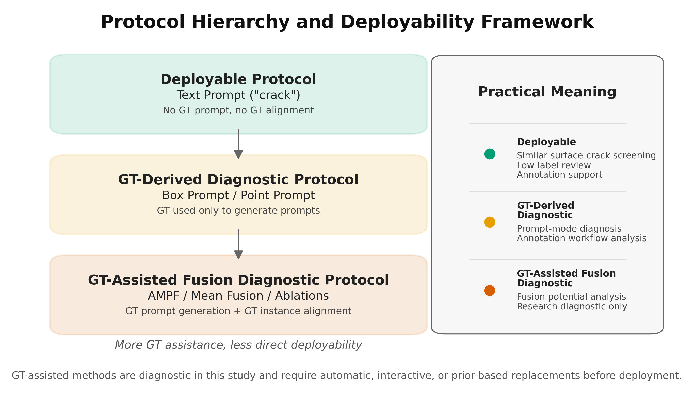
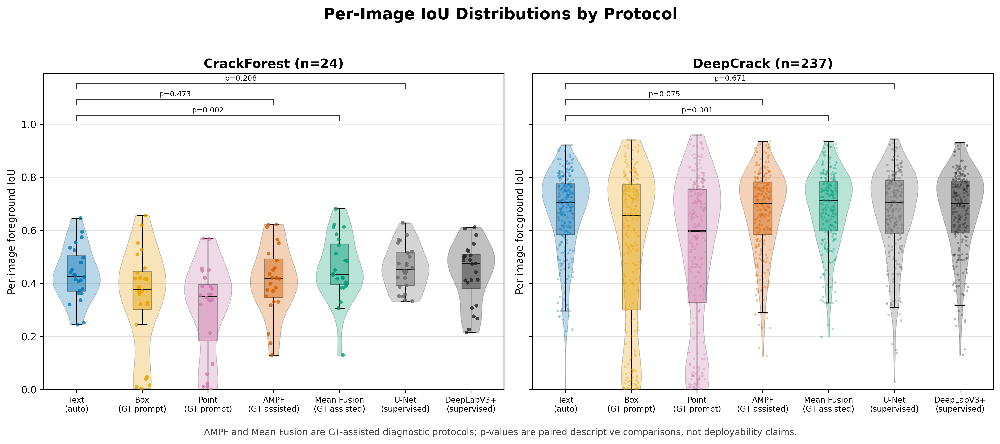
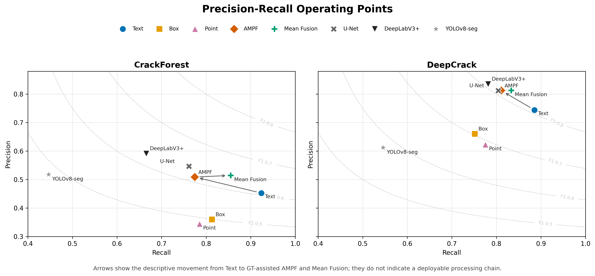

# Protocol-Aware Evaluation of SAM3 Prompt Modes and Fusion Strategies for Training-Free Crack Segmentation in Smart Infrastructure Inspection

## Abstract

Crack segmentation is a key perception task for smart infrastructure inspection, because visible surface cracks in pavements and concrete components provide early visual evidence of deterioration [1,2]. Supervised segmentation models can perform well, but they require pixel-level annotations and may need retraining when materials, cities, camera platforms, or environmental conditions change [3-8]. Promptable vision foundation models offer a different route: they can be queried at inference time using semantic or spatial prompts [14-18]. This paper presents a protocol-aware evaluation of Segment Anything Model 3 (SAM3), as implemented through the Ultralytics SAM3 interface, for training-free segmentation of visible surface cracks on CrackForest and DeepCrack.

The study separates three types of evidence that are often conflated in promptable-segmentation experiments: deployable automatic text prompting, ground-truth-derived spatial prompt diagnostics, and ground-truth-assisted fusion diagnostics. A fixed text prompt, "crack", is the only fully automatic SAM3 prompt protocol in the experiments. It achieves mean foreground IoU/Dice of 0.4355/0.6000 on CrackForest and 0.6658/0.7866 on DeepCrack, matching the reference supervised U-Net baseline on DeepCrack within 0.0003 IoU and showing no significant paired difference from U-Net or DeepLabV3+ on that dataset. Ground-truth-derived box and point prompts underperform text prompting, even after correcting the point protocol so that every point lies on a foreground crack pixel. A confidence-weighted Adaptive Multi-Prompt Fusion (AMPF) pipeline improves precision relative to text prompting on DeepCrack, but it does not significantly improve foreground IoU. Under a ground-truth-assisted alignment protocol, simple mean fusion achieves the highest diagnostic IoU on both datasets, reaching 0.4587 on CrackForest and 0.6815 on DeepCrack, but this result is not directly deployable because it depends on ground-truth-derived prompts and instance matching. The main practical conclusion is conservative: on the evaluated visible surface-crack benchmarks, SAM3 text prompting is a strong deployable baseline for low-label screening and annotation support, while multi-prompt fusion should be treated as a diagnostic research direction unless automatic prompt generation and alignment are introduced.

**Keywords:** smart infrastructure inspection; crack segmentation; SAM3; promptable segmentation; vision foundation model; training-free segmentation; protocol-aware evaluation; infrastructure health monitoring

## 1. Introduction

Urban infrastructure systems require continuous inspection to maintain safety, serviceability, and resilience. Visible surface cracks in pavements and concrete components are among the common visual indicators used in infrastructure condition assessment [1,2]. Manual inspection is expensive, subjective, and difficult to scale across large road and asset networks. Computer vision can support automated or semi-automated inspection, especially when deployed with mobile mapping vehicles, unmanned aerial systems, fixed cameras, or digital twin platforms [1,2].

Deep learning has substantially improved crack detection and segmentation. U-Net, DeepLabV3+, YOLO-style segmentation models, and crack-specific architectures can learn discriminative features from annotated datasets [3-13]. However, practical deployment remains constrained by annotation cost and domain shift. Pixel-level crack masks are labor-intensive to collect. Models trained on one dataset may degrade when transferred to different pavement textures, structural materials, illumination conditions, viewpoints, or image resolutions. For city agencies and infrastructure operators, retraining and validating a supervised model for every new deployment context can become a major operational barrier.

Promptable segmentation models change the design space. Instead of training a crack-specific model, a foundation model can be queried using a text prompt, a bounding box, a point click, an image exemplar, or a combination of prompts [14-18]. SAM3 extends the Segment Anything family toward promptable concept segmentation, where a model detects, segments, and tracks instances corresponding to user-specified visual concepts [16,18]. In principle, this is attractive for infrastructure inspection: a user may request "crack" and obtain masks without collecting a task-specific training set.

Visible surface cracks are a demanding test case for promptable segmentation. They are thin, elongated, branching, discontinuous, and often low contrast, even when they are visually apparent to a human inspector. A prompt mode that performs well on compact objects may fail on crack-like geometries. Prompt modes also differ structurally: text prompting searches globally for all matching concepts, box prompting constrains spatial extent, and point prompting provides local evidence for one or more instances. These outputs may differ in number, confidence calibration, and spatial coverage. Therefore, a fair evaluation must ask not only whether SAM3 can segment cracks in these public surface-crack benchmarks, but also which prompt protocols are deployable, which protocols use ground truth, and which apparent gains depend on diagnostic assistance.

This paper evaluates SAM3 prompt modes and fusion strategies under explicit protocols. The study makes five contributions:

1. It provides a controlled evaluation of SAM3 text, box, and point prompting for visible surface-crack segmentation on CrackForest and DeepCrack.
2. It distinguishes deployable automatic text prompting from ground-truth-derived spatial prompt diagnostics and ground-truth-assisted fusion diagnostics.
3. It evaluates an Adaptive Multi-Prompt Fusion (AMPF) pipeline with instance-level alignment, confidence-aware fusion, and targeted ablations.
4. It shows that confidence-weighted AMPF changes the precision-recall trade-off but does not significantly improve foreground IoU over text prompting.
5. It compares SAM3-based protocols with reference supervised baselines, while avoiding direct deployability claims for methods that use ground truth during prompt generation or alignment.

The paper is intentionally conservative in its claims. The strongest deployable result is not the most complex fusion method, but the fixed text prompt. The fusion experiments are still valuable because they show that aligned multi-prompt information can contain additional diagnostic signal. However, they also show that fusion results must be interpreted through the protocol that produced them.

## 2. Related Work

### 2.1 Crack Segmentation for Infrastructure Inspection

Crack segmentation has long been studied as a pixel-level vision problem for pavement, concrete, and structural health monitoring [1-8,24-26]. Early approaches used edge detection, thresholding, morphological operations, filtering, and texture descriptors. These methods can be lightweight, but they are sensitive to illumination, shadows, stains, low contrast, and complex surface texture.

Deep learning methods improved robustness by learning hierarchical visual features. U-Net and its variants remain common because skip connections preserve spatial detail [10]. DeepLabV3+ uses atrous spatial pyramid pooling and encoder-decoder refinement for multi-scale segmentation [11]. YOLO-style instance segmentation can provide efficient object-level masks, but thin cracks are challenging for detection-oriented pipelines. Crack-specific models such as CrackForest-based structured forests, DeepCrack, feature-pyramid boosting networks, and fully convolutional crack detectors further exploit crack geometry and multi-scale features [3-7,26]. Recent reviews and empirical studies emphasize that annotation cost, illumination variation, background texture, class imbalance, and cross-dataset generalization remain unresolved challenges [24,25]. These models are effective when trained and validated in-domain, but their dependence on labeled data limits fast deployment in new infrastructure contexts.

### 2.2 Promptable Foundation Models

The Segment Anything family introduced promptable segmentation as a flexible visual interface [14]. SAM and SAM2 focused primarily on spatial or interactive prompting [14,15]. SAM3 adds promptable concept segmentation, where text or exemplar prompts can identify all instances of a visual concept in images or videos [16,18]. This capability is relevant to infrastructure inspection because defects such as cracks, spalling, corrosion, lane markings, and surface distress can be expressed as visual concepts. Recent SAM-based application studies in medical imaging and pavement distress inspection also show how promptable segmentation can reduce task-specific annotation requirements while exposing new protocol and domain-shift questions [19,20].

However, open-vocabulary promptability does not guarantee task-level reliability. Crack segmentation requires fine spatial delineation of narrow structures, not only object discovery. The present study therefore evaluates SAM3 on foreground crack IoU, Dice, precision, and recall, rather than relying on generic foundation-model benchmarks.

### 2.3 Multi-Prompt Fusion

Multi-prompt fusion aims to combine complementary information from different prompt types. Text prompts provide semantic intent and global search. Box prompts provide spatial constraint or exemplar-like information. Point prompts provide local instance cues. In practice, their outputs may be heterogeneous: one text prompt may return several masks, one box may cover multiple crack fragments, and one point may recover only a local segment. Naively unioning or averaging such outputs can introduce false positives, suppress true positives, or combine masks that refer to different objects.

The AMPF pipeline evaluated in this paper addresses this by aligning candidates at the instance level before fusion. The key limitation is that the alignment used here is ground-truth-assisted. Consequently, AMPF and mean-fusion variants are not treated as deployable algorithms in their current form. They are diagnostic tools for understanding whether multi-prompt information could be useful if automatic proposal and alignment mechanisms were available.

## 3. Materials and Methods

### 3.1 Task Definition

Given an RGB image \(I \in \mathbb{R}^{H \times W \times 3}\) from a visible surface-crack benchmark, the task is to predict a binary crack mask \(M \in \{0,1\}^{H \times W}\). Predictions are compared with pixel-level ground-truth crack masks. The primary metric is mean foreground crack IoU, computed per image and averaged over the test set. Dice, precision, recall, and F1 are also reported.

The SAM3 prompt modes studied here produce different outputs:

- **Text prompt:** a fixed concept prompt, "crack", returns one or more candidate masks over the full image.
- **Box prompt:** a ground-truth-derived bounding rectangle around all foreground crack pixels is used as a spatial diagnostic prompt.
- **Point prompt:** one positive point is generated for each ground-truth connected crack component. The component centroid is computed first; if the rounded centroid falls on background, the nearest foreground pixel in the same component is used.

The point protocol is therefore foreground-guaranteed but still weak: one point per connected component may not capture the full extent of elongated, branching, or discontinuous cracks.

### 3.2 Prompt Protocols

The experiments use an explicit `protocol` field. This field is central to interpretation.

| Protocol | Methods | Uses GT to Generate Prompt | Uses GT for Alignment | Interpretation |
|---|---|---:|---:|---|
| `automatic_text_prompt` | Text | No | No | Deployable training-free baseline |
| `oracle_gt_prompt` | Box, Point | Yes | No | Ground-truth-derived spatial prompt diagnostic |
| `oracle_gt_prompt_gt_alignment` | AMPF, ablations, prompt-mode combinations, mean fusion | Yes | Yes | Ground-truth-assisted fusion diagnostic |
| `supervised_train_val_test` | U-Net, DeepLabV3+, YOLOv8-seg | Yes, during training | No | Reference supervised baseline |

**Figure 1.** Protocol hierarchy and deployability framework used in this study. The text-prompt protocol is the only fully automatic SAM3 protocol. The deployable level refers to low-label screening and annotation support for imagery similar to the evaluated visible surface-crack benchmarks. Spatial prompts use ground-truth-derived prompt information, and fusion protocols additionally use ground-truth-assisted instance alignment; these latter protocols are diagnostic rather than directly deployable.

This separation prevents a major misinterpretation. Text prompting is the only fully automatic SAM3 protocol in the experiments. Box, point, AMPF, and mean-fusion variants use ground truth either to generate prompts or to align candidates. They are useful for analysis, but they are not directly deployable without replacing ground-truth assistance with automatic proposals, interactive prompts, asset priors, or human-in-the-loop input.

### 3.3 Prompt Generation

Text mode uses the fixed prompt:

\[
p_{\text{text}} = \text{"crack"}.
\]

Box mode uses the minimum axis-aligned rectangle enclosing all foreground crack pixels:

\[
p_{\text{box}} = [x_{\min}, y_{\min}, x_{\max}, y_{\max}].
\]

This is a single image-level box, not a per-instance box protocol. It is therefore a diagnostic baseline rather than a strong box-prompt upper bound.

Point mode decomposes the ground-truth mask into connected components. For each component, the geometric centroid is rounded to the nearest pixel. If the pixel is foreground and belongs to the same component, it is used directly. Otherwise, the nearest foreground pixel in the component is selected by Euclidean distance. This corrected protocol avoids the artifact where centroids of concave or branching crack components fall on background.

### 3.4 Adaptive Multi-Prompt Fusion

AMPF is a three-stage inference-time pipeline implemented in the project code.

#### 3.4.1 Independent Prompting

Text, box, and point prompts are executed independently. Text mode uses a SAM3 confidence threshold of 0.25. Point mode selects the highest-scoring mask when multiple masks are returned for a point prompt. Candidate masks are stored with their detection scores and prompt mode.

#### 3.4.2 Ground-Truth-Assisted Instance Alignment

The ground-truth mask is decomposed into connected components. For each ground-truth instance, text and box candidates are matched by selecting the candidate with the highest IoU above 0.1. Point candidates are matched by prompt order and checked by IoU. This produces an aligned candidate set for each crack instance.

This stage is explicitly diagnostic. It isolates the fusion problem under known instance correspondence. It should not be described as a fully automatic deployment algorithm.

#### 3.4.3 Confidence-Aware Fusion

For each aligned candidate, AMPF computes:

\[
C = \alpha S_{\text{det}} + \beta S_{\text{stab}} + \gamma S_{\text{bound}},
\]

where \(\alpha = 0.4\), \(\beta = 0.35\), and \(\gamma = 0.25\).

\(S_{\text{det}}\) is the SAM3 detection or segmentation score. \(S_{\text{stab}}\) measures consistency under prompt perturbation: text prompts are varied using synonyms, boxes are shifted slightly, and points are perturbed by a few pixels. \(S_{\text{bound}}\) measures image-gradient strength near the predicted mask boundary when the source image is available, with a mask-contour fallback otherwise.

Candidates below confidence 0.5 are filtered. If all candidates are below threshold, the highest-confidence candidate is retained. Remaining masks are fused by confidence-weighted pixel averaging, binarized at 0.5, and post-processed by morphological closing followed by opening with a 3 by 3 elliptical kernel. Per-instance fused masks are combined by logical OR.

### 3.5 Evaluation Metrics

For a prediction \(P\) and ground truth \(G\), the evaluation computes:

\[
\text{IoU} = \frac{|P \cap G|}{|P \cup G|},
\]

\[
\text{Dice} = \frac{2|P \cap G|}{|P| + |G|},
\]

\[
\text{Precision} = \frac{TP}{TP + FP}, \quad
\text{Recall} = \frac{TP}{TP + FN},
\]

\[
F1 = \frac{2 \cdot \text{Precision} \cdot \text{Recall}}{\text{Precision} + \text{Recall}}.
\]

All masks are binarized before metric computation. IoU is reported as per-image foreground crack IoU averaged over the test set, not as class-averaged semantic-segmentation mIoU including background. Dice and F1 are numerically identical in this binary pixel setting, so the main tables emphasize IoU, Dice, precision, and recall.

### 3.6 Statistical Analysis

Where paired comparisons are reported, per-image IoU values are matched by `image_id`. Wilcoxon signed-rank tests are used as descriptive non-parametric paired tests. Statistical results are interpreted cautiously because protocols differ in deployability and CrackForest contains only 24 test images.

## 4. Experimental Setup

### 4.1 Datasets

Two public crack datasets are used.

| Dataset | Images | Resolution | Split Used | Test Images | Scene Characteristics |
|---|---:|---|---|---:|---|
| CrackForest | 118 labeled pairs | 480 by 320 | 60/20/20 random split, seed 42 | 24 | Visible pavement surface cracks |
| DeepCrack | 537 labeled pairs | Multi-scale | Official test split; train split divided 80/20 for train/validation | 237 | Visible surface cracks in pavement, bridge, and concrete scenes |

CrackForest ground truth is loaded from MATLAB files where crack pixels correspond to the segmentation label used in the loader. DeepCrack labels are loaded from PNG masks and binarized at threshold 127. Validation tests check that train, validation, and test splits are disjoint.

### 4.2 Implementation Environment

Experiments were run with an NVIDIA GeForce RTX 3090 GPU with 24 GB VRAM, CUDA-enabled PyTorch, Ultralytics SAM3, and `sam3.pt` in half precision. The primary result file contains 4176 per-image rows.

The supervised baselines include U-Net, DeepLabV3+, and YOLOv8-seg. U-Net and DeepLabV3+ use `segmentation_models_pytorch` with ResNet-34 encoders initialized from ImageNet weights, trained for 50 epochs with Adam and a combined BCE+Dice loss. YOLOv8-seg uses the Ultralytics training interface after converting masks to polygon annotations, trained for 100 epochs with default YOLO settings. These are reference baselines, not exhaustively tuned state-of-the-art systems.

## 5. Results

### 5.1 Deployable Text Prompting

Text prompting is the strongest single prompt mode on both datasets and is the only fully automatic SAM3 prompt protocol in the study.

| Method | Protocol | CrackForest IoU | CrackForest Dice | CrackForest Precision | CrackForest Recall | DeepCrack IoU | DeepCrack Dice | DeepCrack Precision | DeepCrack Recall |
|---|---|---:|---:|---:|---:|---:|---:|---:|---:|
| Text | automatic text prompt | **0.4355** | **0.6000** | 0.4525 | **0.9237** | **0.6658** | **0.7866** | 0.7441 | **0.8854** |
| Box | GT-derived prompt | 0.3439 | 0.4786 | 0.3597 | 0.8132 | 0.5408 | 0.6441 | 0.6603 | 0.7516 |
| Point | GT-derived prompt | 0.3014 | 0.4332 | 0.3445 | 0.7854 | 0.5199 | 0.6278 | 0.6229 | 0.7754 |

Figure 2 shows the corresponding per-image IoU distributions for the deployable text prompt, diagnostic SAM3 protocols, and reference supervised baselines. The distribution view is important because CrackForest contains only 24 test images, while DeepCrack provides a larger paired test set.

**Figure 2.** Per-image foreground IoU distributions on CrackForest and DeepCrack. AMPF and Mean Fusion are GT-assisted diagnostic protocols, so the paired p-values should be read as protocol-aware descriptive comparisons rather than deployability claims.

The text prompt achieves high recall, which is valuable for inspection workflows where missed defects are costly. Its lower precision indicates over-segmentation of crack-like texture or background artifacts, suggesting that practical use should include review, post-processing, or secondary filtering.

Box and point prompts underperform text prompting even though they use ground-truth-derived spatial information. This should not be interpreted as evidence that all spatial prompting is weak. The box protocol uses one global box around all foreground pixels, and the point protocol uses only one point per connected component. Both are diagnostic protocols, not optimized interactive prompt strategies.

### 5.2 Point Protocol Correction

The nearest-foreground point protocol substantially improves point prompting relative to the earlier centroid-only protocol.

| Dataset | Old Centroid Point IoU | Nearest-Foreground Point IoU | Absolute Gain |
|---|---:|---:|---:|
| CrackForest | 0.1166 | 0.3014 | +0.1848 |
| DeepCrack | 0.3129 | 0.5199 | +0.2070 |

The gain shows that centroid misplacement was a real artifact. However, point prompting remains weaker than text and box prompting. The remaining gap likely reflects the geometry of cracks: a single point often recovers a local region rather than tracing a long, branching, or discontinuous crack.

### 5.3 AMPF and Prompt-Mode Combinations

Confidence-weighted AMPF does not significantly improve foreground IoU over text prompting. On DeepCrack it increases precision from 0.7441 to 0.8126, but recall decreases from 0.8854 to 0.8105.

| Method | Protocol | CrackForest IoU | CrackForest Dice | DeepCrack IoU | DeepCrack Dice |
|---|---|---:|---:|---:|---:|
| Text | automatic text prompt | **0.4355** | **0.6000** | 0.6658 | 0.7866 |
| AMPF | GT-assisted fusion diagnostic | 0.4145 | 0.5737 | **0.6671** | **0.7880** |
| Text + Box | GT-assisted fusion diagnostic | 0.4282 | 0.5865 | 0.6654 | 0.7860 |
| Text + Point | GT-assisted fusion diagnostic | 0.3972 | 0.5580 | 0.6435 | 0.7688 |
| Box + Point | GT-assisted fusion diagnostic | 0.4012 | 0.5557 | 0.6466 | 0.7645 |

Figure 3 shows that AMPF mainly changes the precision-recall operating point rather than producing a stable foreground-IoU gain. On DeepCrack, AMPF moves from the high-recall text-prompt point toward higher precision and lower recall, while mean fusion gives a more balanced diagnostic operating point under GT-assisted alignment.

**Figure 3.** Precision-recall operating points for SAM3 protocols and supervised baselines. Arrows show the descriptive movement from Text to GT-assisted AMPF and Mean Fusion; they do not indicate a deployable processing chain.

Adding point candidates generally reduces performance under confidence-weighted fusion. This suggests that improved point masks are still not reliably beneficial under the current weighted fusion rule. Weak prompt modes can degrade a strong text baseline when their confidence scores are overweighted.

### 5.4 Ablation Study

The ablation study shows that alignment is the most important component, while the current confidence weighting is not consistently beneficial.

| Configuration | Protocol | CrackForest IoU | CrackForest Dice | DeepCrack IoU | DeepCrack Dice |
|---|---|---:|---:|---:|---:|
| AMPF | GT-assisted fusion diagnostic | 0.4145 | 0.5737 | 0.6671 | 0.7880 |
| without \(S_{\text{det}}\) | GT-assisted fusion diagnostic | 0.4087 | 0.5668 | 0.6639 | 0.7844 |
| without \(S_{\text{stab}}\) | GT-assisted fusion diagnostic | 0.4279 | 0.5848 | 0.6691 | 0.7894 |
| without \(S_{\text{bound}}\) | GT-assisted fusion diagnostic | 0.4122 | 0.5718 | 0.6605 | 0.7825 |
| without alignment | GT-assisted fusion diagnostic | 0.3506 | 0.4847 | 0.4676 | 0.5489 |
| fusion = max | GT-assisted fusion diagnostic | 0.4084 | 0.5699 | 0.6746 | 0.7936 |
| fusion = mean | GT-assisted fusion diagnostic | **0.4587** | **0.6192** | **0.6815** | **0.8012** |

Removing alignment reduces DeepCrack IoU by 0.1995, from 0.6671 to 0.4676. On CrackForest, the mean reduction is 0.0638, but the paired test is not significant at the 0.05 level because the test set is small and many paired differences are zero.

The strongest fusion result is simple mean fusion, not confidence-weighted AMPF. Mean fusion improves foreground IoU over text prompting by 0.0232 on CrackForest and 0.0157 on DeepCrack under the GT-assisted alignment protocol. This supports the diagnostic value of aligned multi-prompt information, while indicating that the current confidence-weighted fusion rule is not reliably beneficial for crack segmentation.

### 5.5 Paired Statistical Comparisons

| Dataset | Comparison | n | Mean IoU Difference | Median IoU Difference | Wilcoxon p-value | Interpretation |
|---|---|---:|---:|---:|---:|---|
| DeepCrack | AMPF - without alignment | 237 | +0.1995 | +0.0353 | 1.16e-23 | Alignment is critical under the diagnostic protocol |
| CrackForest | AMPF - without alignment | 24 | +0.0638 | 0.0000 | 0.0627 | Directionally positive but not significant |
| DeepCrack | Mean fusion - Text | 237 | +0.0157 | +0.0054 | 0.00149 | Significant diagnostic gain, not deployable as-is |
| CrackForest | Mean fusion - Text | 24 | +0.0232 | +0.0166 | 0.00225 | Significant diagnostic gain under GT-assisted alignment |
| DeepCrack | AMPF - Text | 237 | +0.0013 | +0.0046 | 0.0754 | No significant IoU gain |
| CrackForest | AMPF - Text | 24 | -0.0210 | +0.0084 | 0.473 | No significant IoU gain |
| DeepCrack | Text - U-Net | 237 | -0.0003 | -0.0115 | 0.671 | No significant paired difference observed |
| DeepCrack | Text - DeepLabV3+ | 237 | -0.0040 | -0.0152 | 0.413 | No significant paired difference observed |
| CrackForest | Text - U-Net | 24 | -0.0221 | -0.0201 | 0.208 | No significant difference on the small split |

These results reinforce the central claim for the evaluated visible surface-crack datasets: text prompting is the strongest deployable SAM3 baseline, while mean fusion is a promising but GT-assisted diagnostic result.

### 5.6 Comparison with Supervised Baselines

| Method | Protocol | CrackForest IoU | CrackForest Dice | DeepCrack IoU | DeepCrack Dice |
|---|---|---:|---:|---:|---:|
| Text | automatic text prompt | 0.4355 | 0.6000 | 0.6658 | 0.7866 |
| AMPF | GT-assisted fusion diagnostic | 0.4145 | 0.5737 | 0.6671 | 0.7880 |
| Mean fusion | GT-assisted fusion diagnostic | **0.4587** | 0.6192 | **0.6815** | **0.8012** |
| U-Net | supervised train/val/test | 0.4576 | **0.6236** | 0.6661 | 0.7855 |
| DeepLabV3+ | supervised train/val/test | 0.4384 | 0.6004 | 0.6698 | 0.7906 |
| YOLOv8-seg | supervised train/val/test | 0.3069 | 0.4533 | 0.4198 | 0.5652 |

On DeepCrack, no significant paired IoU difference is observed between automatic text prompting and the reference U-Net or DeepLabV3+ baselines. This is the main practical result. Mean fusion achieves the highest IoU, but it is not directly comparable as a deployable method because it uses GT-assisted prompting and alignment. On CrackForest, U-Net has the strongest supervised result, but the test set contains only 24 images, so this comparison should be treated cautiously.

### 5.7 Qualitative Analysis

Quantitative tables alone do not show how each prompt mode fails on thin crack geometries. A qualitative comparison panel should therefore accompany the final submission. The panel should include representative test images with seven columns: original image, ground truth, text prompt, box prompt, point prompt, AMPF, and mean fusion. The corresponding generation script is provided as `experiments/generate_qualitative_figure.py` and saves the panel to `experiments/visualizations/fig_qualitative_prompt_examples.png` when the datasets and SAM3 checkpoint are available.

The qualitative figure should be selected to illustrate four phenomena observed in the metrics. First, text prompting often captures most of the crack region, explaining its high recall, but may also include crack-like background texture. Second, point prompting tends to recover local regions around each positive point and can miss long crack branches. Third, confidence-weighted AMPF can suppress false positives but may introduce false negatives, consistent with the precision increase and recall decrease on DeepCrack. Fourth, mean fusion can recover complementary mask regions under GT-assisted alignment, but this improvement should be shown with the protocol caveat that the prompts and instance correspondence are not automatic.

## 6. Discussion

### 6.1 Text Prompting Is the Strongest Deployable Baseline

The most actionable result is that a single text prompt, "crack", performs competitively on the evaluated visible surface-crack benchmarks without task-specific training. For similar pavement or concrete-surface imagery, this matters in three practical scenarios: rapid preliminary screening, semi-automatic annotation of crack datasets, and human-in-the-loop inspection where high recall is preferred before expert verification.

Text prompting is not ready to replace an operational inspection system by itself. Its precision is lower than the precision of AMPF and some supervised baselines, meaning it may over-segment shadows, stains, joints, texture, or other crack-like structures. However, high recall is valuable in inspection workflows where missed defects may be more costly than false alarms.

### 6.2 Spatial Prompts Need Better Deployment Protocols

The box and point results should not be read as a final verdict against spatial prompting. They are ground-truth-derived diagnostic baselines. The box protocol uses a single global foreground box, which can include large background regions. The point protocol uses one point per connected component, which is often too sparse for long cracks.

A stronger deployable spatial protocol would require automatic region proposals, skeleton-based multi-point prompts, iterative point refinement, or human-in-the-loop correction. These variants were outside the scope of the current experiments but are natural next steps.

### 6.3 Alignment Is Necessary but Not Sufficient

The no-alignment ablation confirms that heterogeneous prompt outputs cannot be fused reliably without correspondence. Text, box, and point masks may refer to different spatial entities or different extents of the same crack. Ground-truth-assisted alignment removes this ambiguity for diagnostic purposes.

However, alignment alone does not make the full AMPF pipeline superior to text prompting. The ablation results suggest that the confidence-weighted fusion rule is not reliably beneficial for cracks in its current form. Removing the stability component improves IoU, and mean fusion outperforms the confidence-weighted variant. Text synonym perturbations may change semantics rather than preserve a stable target concept; "fracture" and "fissure" are visually related to "crack" but may not behave as harmless perturbations in SAM3.

### 6.4 Mean Fusion Is a Diagnostic Positive Result

Mean fusion provides the clearest positive fusion result. It improves IoU over text prompting on both datasets under the GT-assisted alignment protocol. This suggests that multi-prompt information contains additional signal when candidates are aligned.

The deployment caveat is essential. Mean fusion does not yet define an operational algorithm because the prompts and alignment use ground truth. Its value is to motivate future work on automatic proposal generation and alignment, not to claim immediate replacement of supervised crack segmentation.

### 6.5 Relevance to AI-Driven Urban Development and Smart Infrastructure

The study contributes to smart infrastructure inspection by evaluating a low-label, promptable segmentation approach for apparent surface-crack assessment. A practical workflow for similar image conditions could use mobile inspection vehicles, UAVs, or fixed cameras to collect imagery; apply SAM3 text prompting for high-recall crack screening; route uncertain cases to human review; and project reviewed masks into GIS or digital-twin maintenance layers. Such a workflow could reduce annotation burden and support maintenance prioritization across road segments, bridge components, or other asset records, but it should not be assumed to cover hidden damage, subsurface defects, severe occlusion, or substantially different imaging conditions without further validation.

The results also provide a pragmatic warning for AI-driven infrastructure systems: foundation models should be evaluated under deployment-aware protocols. A method that uses ground truth during prompt generation or alignment may be useful for research diagnosis, but it should not be presented as a deployable smart-city inspection solution without an automatic or interactive mechanism replacing the ground-truth assistance.

## 7. Limitations

This study has several limitations.

First, only text prompting is fully automatic in the current SAM3 experiments. Box, point, AMPF, prompt-mode combinations, and mean fusion use ground-truth-derived prompts or ground-truth-assisted alignment.

Second, the box protocol uses one global foreground box per image. A per-instance box protocol or automatic proposal protocol could produce different results.

Third, the point protocol uses one nearest-foreground point per connected component. This avoids background centroid artifacts but remains sparse for elongated, branching, or fragmented cracks.

Fourth, both public benchmarks mainly contain visually apparent surface cracks. CrackForest contains only 24 test images under the selected split, and DeepCrack provides a stronger but still domain-limited test set with 237 images. Broader evaluation on subtle hairline cracks, sealed cracks, stains and joints, tunnel surfaces, bridge components, building facades, wet pavement, night imagery, low-light conditions, oblique mobile-mapping views, and non-concrete or non-pavement materials is needed before general infrastructure-level deployment claims can be made.

Fifth, the supervised baselines are reasonable reference models rather than exhaustively tuned state-of-the-art crack segmentation systems. The comparison contextualizes training-free SAM3 performance but does not prove superiority over all supervised methods.

Sixth, runtime and memory usage are not analyzed in enough detail for real-time deployment. Sequential evaluation required several hours on an RTX 3090. Practical deployment would require batching, feature reuse, model compression, or selective prompting.

Seventh, the experiments rely on the behavior of a specific SAM3 implementation and model checkpoint. Future SAM3 releases, thresholds, or inference interfaces may change the absolute numbers.

## 8. Conclusion

This paper presented a protocol-aware evaluation of SAM3 prompt modes and fusion strategies for visible surface-crack segmentation in smart infrastructure inspection. The strongest deployable result within the evaluated benchmark conditions is automatic text prompting with the fixed prompt "crack", which achieves foreground IoU of 0.4355 on CrackForest and 0.6658 on DeepCrack without task-specific training. On DeepCrack, no significant paired IoU difference is observed between this text-prompt baseline and the reference supervised U-Net or DeepLabV3+ baselines.

Ground-truth-derived box and point prompts underperform text prompting in the current protocols. Correcting point prompts to nearest-foreground points substantially improves point performance, but one point per connected component remains insufficient for many elongated crack structures.

The AMPF study shows that instance-level alignment is important for fusing heterogeneous prompt outputs, especially on DeepCrack. However, confidence-weighted AMPF does not significantly improve foreground IoU over text prompting. The best diagnostic fusion result is simple mean fusion under GT-assisted alignment, which reaches 0.4587 IoU on CrackForest and 0.6815 IoU on DeepCrack. This result shows that aligned multi-prompt information has value, but it is not directly deployable because it depends on ground-truth-derived prompts and alignment.

The practical recommendation is therefore conservative: for low-label screening or annotation support on imagery similar to CrackForest and DeepCrack, SAM3 text prompting should be treated as the primary deployable training-free baseline. Multi-prompt fusion is promising as a research direction, but future work must replace GT-assisted prompt generation and alignment with automatic proposals, human-in-the-loop input, or infrastructure-aware priors before claiming operational deployment across broader infrastructure inspection scenarios.

## Data and Code Availability

The manuscript is based on the project implementation and result files. The primary result files for the nearest-foreground point protocol are:

- `experiments/results/all_results_v2.csv`
- `experiments/results/summary_stats_v2.csv`
- `experiments/results/paper_tables_v2.tex`
- `experiments/visualizations/`

The main implementation files are:

- `experiments/run_experiments.py`
- `experiments/run_baselines.py`
- `experiments/prompt_generator.py`
- `experiments/evaluation.py`
- `experiments/data_loader.py`
- `backend/app/services/ampf_engine.py`
- `backend/app/services/segmentation_service.py`
- `experiments/plot_protocol_hierarchy.py`
- `experiments/plot_iou_distribution.py`
- `experiments/plot_precision_recall.py`
- `experiments/generate_qualitative_figure.py`

For peer review, the experiment code, result CSV files, table-generation script, figure-generation scripts, and qualitative-figure script are supplied as supplementary material. If the SAM3 weights cannot be redistributed with the replication package, the package should include instructions for obtaining the checkpoint through the official model release or the Ultralytics interface.

## Author Contributions

Conceptualization, methodology, software, validation, formal analysis, investigation, data curation, writing-original draft, and writing-review and editing should be completed according to the final author list before submission.

## Conflicts of Interest

The authors should declare any conflicts of interest before submission.

## References

1. Koch, C.; Georgieva, K.; Kasireddy, V.; Akinci, B.; Fieguth, P. A review on computer vision based defect detection and condition assessment of concrete and asphalt civil infrastructure. *Advanced Engineering Informatics* 2015, 29, 196-210.
2. Sony, S.; Laventure, S.; Sadhu, A. A literature review of next-generation smart sensing technology in structural health monitoring. *Structural Control and Health Monitoring* 2019, 26, e2321.
3. Shi, Y.; Cui, L.; Qi, Z.; Meng, F.; Chen, Z. Automatic road crack detection using random structured forests. *IEEE Transactions on Intelligent Transportation Systems* 2016, 17, 3434-3445.
4. Liu, Y.; Yao, J.; Lu, X.; Xie, R.; Li, L. DeepCrack: A deep hierarchical feature learning architecture for crack segmentation. *Neurocomputing* 2019, 338, 139-153.
5. Yang, F.; Zhang, L.; Yu, S.; Prokhorov, D.; Mei, X.; Ling, H. Feature pyramid and hierarchical boosting network for pavement crack detection. *IEEE Transactions on Intelligent Transportation Systems* 2020, 21, 1525-1535.
6. Zhang, A.; Wang, K.C.P.; Li, B.; Yang, E.; Dai, X.; Peng, Y.; Fei, Y.; Liu, Y.; Li, J.Q.; Chen, C. Automated pixel-level pavement crack detection on 3D asphalt surfaces using a deep-learning network. *Computer-Aided Civil and Infrastructure Engineering* 2017, 32, 805-819.
7. Cha, Y.-J.; Choi, W.; Buyukozturk, O. Deep learning-based crack damage detection using convolutional neural networks. *Computer-Aided Civil and Infrastructure Engineering* 2017, 32, 361-378.
8. Mei, Q.; Gul, M. Multi-level feature fusion in densely connected deep-learning architecture and depth-first search for crack segmentation on images collected with smartphones. *Structural Health Monitoring* 2020, 19, 1726-1744.
9. Long, J.; Shelhamer, E.; Darrell, T. Fully convolutional networks for semantic segmentation. In *Proceedings of CVPR*, 2015.
10. Ronneberger, O.; Fischer, P.; Brox, T. U-Net: Convolutional networks for biomedical image segmentation. In *Proceedings of MICCAI*, 2015.
11. Chen, L.-C.; Zhu, Y.; Papandreou, G.; Schroff, F.; Adam, H. Encoder-decoder with atrous separable convolution for semantic image segmentation. In *Proceedings of ECCV*, 2018.
12. He, K.; Gkioxari, G.; Dollar, P.; Girshick, R. Mask R-CNN. In *Proceedings of ICCV*, 2017.
13. Xie, S.; Tu, Z. Holistically-nested edge detection. In *Proceedings of ICCV*, 2015.
14. Kirillov, A.; Mintun, E.; Ravi, N.; Mao, H.; Rolland, C.; Gustafson, L.; Xiao, T.; Whitehead, S.; Berg, A.C.; Lo, W.-Y.; Dollar, P.; Girshick, R. Segment Anything. In *Proceedings of ICCV*, 2023.
15. Ravi, N.; Gabeur, V.; Hu, Y.-T.; Hu, R.; Ryali, C.; Ma, T.; Khedr, H.; Radle, R.; Rolland, C.; Gustafson, L.; et al. SAM 2: Segment Anything in images and videos. arXiv preprint arXiv:2408.00714, 2024.
16. Carion, N.; Gustafson, L.; Hu, Y.-T.; Debnath, S.; Hu, R.; Suris, D.; Ryali, C.; Alwala, K.V.; Khedr, H.; Huang, A.; et al. SAM 3: Segment Anything with Concepts. arXiv preprint arXiv:2511.16719, 2025.
17. Ultralytics. SAM 3: Segment Anything with Concepts. Documentation. Available online: https://docs.ultralytics.com/models/sam-3/
18. Liu, S.; Zeng, Z.; Ren, T.; Li, F.; Zhang, H.; Yang, J.; Jiang, Q.; Li, C.; Yang, J.; Su, H.; et al. Grounding DINO: Marrying DINO with grounded pre-training for open-set object detection. arXiv preprint arXiv:2303.05499, 2023.
19. Ma, J.; He, Y.; Li, F.; Han, L.; You, C.; Wang, B. Segment anything in medical images. *Nature Communications* 2024, 15, 654.
20. Owor, N.J.; et al. PaveSAM: Segment Anything for pavement distress. arXiv preprint, 2024.
21. Zhang, Y.; et al. EVF-SAM: Early vision-language fusion for text-prompted Segment Anything Model. arXiv preprint, 2024.
22. Ren, T.; Liu, S.; Zeng, A.; Lin, J.; Li, K.; Cao, H.; Chen, J.; Huang, X.; Chen, Y.; Yan, F.; et al. Grounded SAM: Assembling open-world models for diverse visual tasks. arXiv preprint arXiv:2401.14159, 2024.
23. Ultralytics. YOLOv8 documentation and source code. Available online: https://github.com/ultralytics/ultralytics
24. Gong, H.; Tesic, J.; Tao, J.; Luo, X.; Wang, F. Automated pavement crack detection with deep learning methods: What are the main factors and how to improve the performance? *Transportation Research Record* 2023.
25. Yuan, J.; et al. A state-of-the-art survey of deep learning models for automated pavement crack segmentation. *International Journal of Transportation Science and Technology* 2024, 13, 44-57.
26. Yang, X.; Li, H.; Yu, Y.; Luo, X.; Huang, T.; Yang, X. Automatic pixel-level crack detection and measurement using fully convolutional network. *Computer-Aided Civil and Infrastructure Engineering* 2018, 33, 1090-1109.
