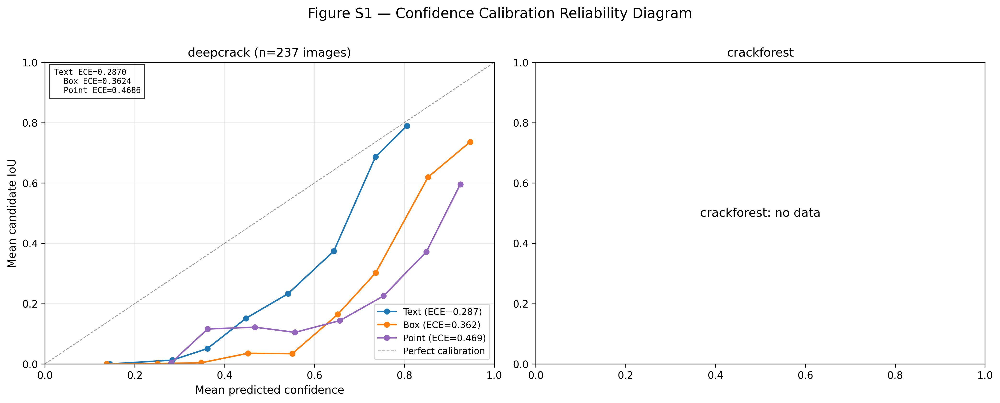
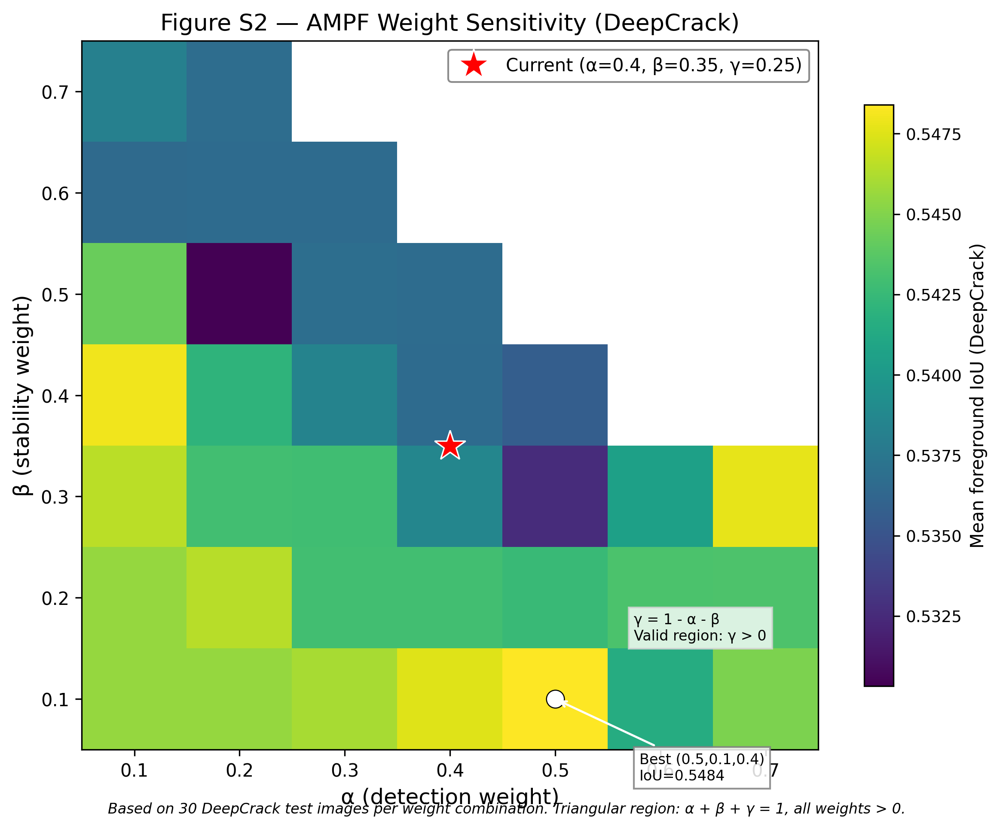
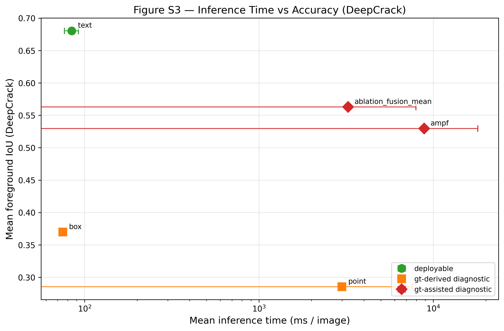

\textsuperscript{1} Hong Kong Generative AI Research \& Development Center

\textsuperscript{*} Correspondence: Chendong Ma, machendong\_intern@hkgai.org

\textsuperscript{‡} These authors contributed equally to this work.

## Supplementary Diagnostics for Confidence, Weights, and Runtime

These supplementary analyses test whether the AMPF conclusions are driven by candidate-confidence calibration, fusion-weight selection, or computational cost. The analyses are diagnostic and subset-specific; they are not used to expand the deployment claim beyond the evaluated visible surface-crack imagery.

**Figure S1.** Candidate-level confidence calibration on DeepCrack. The analysis logs 3449 candidates from 237 DeepCrack test images and compares composite confidence with per-candidate IoU. Composite confidence systematically overestimates candidate IoU. Expected Calibration Error is 0.287 for text candidates, 0.362 for box candidates, and 0.469 for point candidates. These results indicate that the current confidence-weighted fusion rule is poorly calibrated for this visible surface-crack benchmark.

**Figure S2.** AMPF weight sensitivity on a 30-image DeepCrack subset. The grid evaluates 39 combinations of detection, stability, and boundary weights with \(\gamma = 1-\alpha-\beta\) and \(\gamma \geq 0\). A 0.1 grid step was used to keep the subset analysis tractable, so the manuscript setting \((\alpha=0.4,\beta=0.35,\gamma=0.25)\) is assessed through its neighboring grid points rather than rerun exactly in this sweep. Foreground IoU varies only from 0.5303 to 0.5484, with a coefficient of variation of 0.82%. The best observed setting is \(\alpha=0.5, \beta=0.1, \gamma=0.4\). The stability weight is negatively correlated with IoU (\(r=-0.72\)), while the boundary weight is positively correlated with IoU (\(r=+0.54\)). The neighboring grid points \((0.4,0.3,0.3)\) and \((0.4,0.4,0.2)\) have IoU 0.5386 and 0.5367, respectively.

**Figure S3.** Inference time versus foreground IoU on a fixed 20-image DeepCrack profiling subset after warmup. Runtime values are intended as implementation-level profiling rather than a full deployment benchmark. Text prompting achieves 84.3 ms/image with mean IoU 0.680. Box prompting is fast but less accurate (74.9 ms/image, IoU 0.370). Point prompting is slow and low-performing under the one-point-per-component protocol (2990.8 ms/image, IoU 0.285). AMPF is the slowest tested SAM3 protocol (8866.2 ms/image, IoU 0.529), mainly because it combines multiple prompt modes with stability perturbation reruns. Mean fusion avoids confidence and stability scoring and is faster than AMPF (3248.0 ms/image, IoU 0.563), but it remains GT-assisted.
